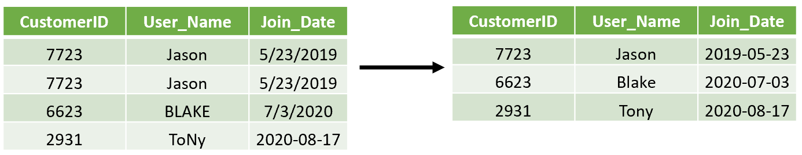

## ETL compared to ELT
In the last video, you learned how ELT (**E**xtract, **L**oad, **T**ransform) compares to the ETL (**E**xtract, **T**ransform, **L**oad) process we've discussed throughout the course. In this exercise, show your understanding of the differences between the two processes. Organize the different features of each process into the correct category.

**Instructions**

Place the statement about ETL and ELT processes in correct bucket.

Here's the table in Markdown format based on the information in the image:

| ETL | ELT |
| --- | --- |
| Uses a separate computer system for transforming data. | Errors/changes in the transformation process do not require new data pulls. |
| Can make it easier to comply with PII security regulations because sensitive data can be excluded in the data loaded into the warehouse. | It is often used for near real-time processes|
| Stores only the transformed data in the data warehouse, leading to lower storage costs. | Saves a copy of the raw data from the input systems in the data warehouse too. |

> Congratulations on identifying the differences between ETL and ELT processes. While each has similar steps, it is crucial to understand the strengths of each approach.

 

## Differences between ETL and ELT
ETL and ELT sound very similar, but how they integrate and transform data is very different. Select the statement that is **false** about ETL and ELT processes. Select one answer.

- [ ] The ELT process moves the data first before it is transformed.
- [ ] The data transformation process happens as the data moves from the input sources to the data warehouse in the ETL process.
- [x] The ELT process uses a separate computer system to complete the data transformations.
- [ ] The ETL and ELT processes extract data from input sources but differ in where and when the data is transformed and moved into the data warehouse.

> Great job! The ETL and not ELT processes use a separate computer system to perform the data transformation step.

 

## Selecting ELT
You work for an electrical utility, and many of your customers have smart meters that send near real-time updates of power consumption. You are looking to implement a data warehouse to collect this data to analyze customer demand and enrich it or add information about current weather conditions and electrical plant operations.

You are still determining the transformation integration steps, which may need to be updated. Finally, the organization wants to use a cloud service to help process a large amount of data. Considering all these factors, you decide to use an ELT process for the data warehouse.

Select which answer is **not** a justification for using the **ELT** process. Select one answer.

- [ ] The ELT process works well when needing to change/update data transformation processes because a copy of the original raw data from the source systems is stored.
- [ ] The ELT process works well for near real-time data processing requirements because complex data transformations do not slow down the data movement process.
- [x] The ELT process reduces the amount of computing and storage needed because the data transformations are done as the data moves, and the process only stores the transformed data.

> Great job! You are correct that this answer does not provide a reasonable justification for using an ELT process, mainly because it describes an ETL process where data is transformed as it is moved, and only the transformed data is stored.

 

## Cleaning operations
In this exercise, you start with user data on the table on the left. It is then transformed and cleaned into the table on the right.

Select the **true** statement about which data cleaning processes were used to transform the data into the table on the right. Select one answer.

- [x] A combination of data de-duplication and format revision was used to clean the data.
- [ ] A combination of data range check and format revision was used to clean the data.

> Perfect! Always remember that you can apply multiple data-cleaning transformations together to achieve your end result.

 

## Finding truth in data transformations
Select the **true** statement about data cleaning process. Select one answer.

- [ ] You can use data format revisions to remove rows of matching data.
- [x] It is best to fix the source system's data range check and data type check issues.
- [ ] Address parsing combines the different components of an address in one long text string.

> Amazing! You selected the true statement. It is vital to realize that the more you can clean up the source data, the less data cleaning needs to be done during the transformation process.

 

## Understanding data governance
Data governance plays an essential role in the data cleaning process. Select the false statement about data governance. Select one answer.

- [x] Data governance will validate addresses for you.
- [ ] Data governance develops definitions around the data and corrects the data when it deviates from its definition.
- [ ] A solid organizational data governance program will require less data cleaning within the ETL or ELT process.

> Nice work! Data governance is a set of organizational policies and processes to help keep the data clean, but it does not directly validate addresses for you.

 

## Knowing the differences between on-premise and cloud
There are many decisions an organization needs to make when implementing a data warehouse, including whether it should be on-premise or in the cloud. Each approach has its strengths.

**Instructions**

In this exercise, you will correctly identify these strengths by placing the statements in the correct bucket.

Here's the table in Markdown format based on the information in the image:

| An on-premise data warehouse | A cloud data warehouse |
| ---------------------------- | ---------------------- |
| It is used when you need complete control of the entire system | Frees personnel to complete other high-value tasks besides maintaining systems |
| It can be used to implement a custom data governance/regulator approach | Allows the warehouse to scale storage and computing resources as needed without purchasing upfront computing and memory resources |
| Can leverage local network speeds for increased data transfers | It does not require an upfront investment in computers or software |

> Great job! As with so many aspects of implementing a data warehouse, there are multiple ways to accomplish it, but understanding the strengths of different approaches will allow you to choose the best for your organization.

 

## Matching implementation to justification
In this exercise, you are given either a cloud or on-premise implementation, along with a justification.

Choose the scenario that is **not** a reasonable justification for the implementation. Select one answer.

- [ ] **Cloud** - your workload requires massive computing, and you want to avoid the upfront costs.
- [ ] **On-premise** - your data warehouse contains sensitive information, and you need to implement a stringent security and data governance procedure to comply.
- [x] **On-premise** - your organization is unsure of the future demands of the warehouse and will need to scale it over time.

> Excellent work! If you expect to scale your data warehouse resources in the future, a cloud implementation tends to be the best choice because you only pay for the resources you are using. This avoids upfront costs for equipment that you might only need briefly during peak demands on your warehouse.

 

## Connecting it all
In the previous video, you walked through the designing and planning for a data warehouse for a photo-sharing app.

Select the **true** statement. Select one answer.

- [x] Decisions in one area of your design can have impacts in other areas
- [ ] Choosing a bottom-up approach meant we are forced to create a snowflake data model.
- [ ] You must decide on on-premise or cloud implementation before choosing your dimension in step three of Kimball's process.

> Great job! This is the overall takeaway of this course. Therefore, it is best to understand the strengths of each approach.

 

## Selecting bottom-up
You are a leader in a new startup focused on food delivery. One of your main priorities is to report on customer and delivery driver satisfaction. As a new startup, you have limited financial resources. You want to create a bottom-up data warehouse; select which of the below answers is not a good justification for using the bottom-up approach. Select one answer.

- [ ] The time taken in design is shorter, and therefore the initial costs are lower, in a bottom-up design compared to a top-down design.
- [ ] Since the data marts are created first, you can start reporting quicker than in a bottom-up design compared to a top-down design.
- [x] The time taken in design is longer , and therefore the initial costs are higher, in a bottom-up design compared to a top-down design.

> Correct! This statement is false. The initial design time for a data warehouse tends to be shorter for a bottom-up vs. a top-down design, and with limited financial resources, this could be one reason you might want to select the bottoms-up design style.

 

## Do you know it all?
In this course, you have learned a lot about data warehouses. In this exercise, you will test your knowledge. The goal is to ensure that you have a solid understanding of some of the major concepts in this introductory data warehousing course.

**Instructions**

Read each statement carefully, and place it in the correct bucket if it is a true or false statement.

| True statement| False statement |
| ------------- | ---------------|
| Data governance programs work to keep the data in the source systems cleaned, reducing the need for many cleaning steps within the ETL/ELT process. | Dimension tables tend to be longer than fact tables. |
| Kimball's four-step process will help you design your fact and dimension tables. | In a cloud warehouse implementation, you can tune it to fit your workload because you have control over all aspects of the implementation. |
| Top-down implementations tend to have a longer initial setup time/cost than a bottom-up approach. | The main difference between an ETL and an ELT process is when the data is extracted. |

> Congratulations! Great work! It is clear that you have an understanding of some of the basics of data warehousing.
