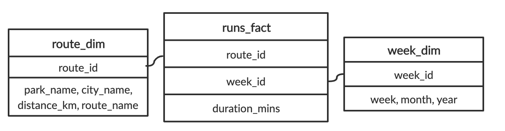

## OLAP vs. OLTP
You should now be familiar with the differences between OLTP and OLAP. In this exercise, you are given a list of cards describing a specific approach which you will categorize between OLAP and OLTP.

**Instructions**

Categorize the cards into the approach that they describe best.

| OLAP | OLTP |
| ---- | ---- |
| Queries a larger amount of data. | Most likely to have data from the past hour. |
| Typically uses a data warehouse. | Typically uses an operational database. |
| Helps businesses with decision-making and problem-solving. | Data is inserted and updated more often. |

> Great work, you've got the differences between the two down. In the rest of the course, we'll be referring to these two terms while delving deeper into their technical differences - so don't forget them!

<br>

## Which is better?
The city of Chicago receives many 311 service requests throughout the day. 311 service requests are non-urgent community requests, ranging from graffiti removal to street light outages. Chicago maintains a data repository of all these services organized by type of requests. In this exercise, Potholes has been loaded as an example of a table in this repository. It contains pothole reports made by Chicago residents from the past week.

Explore the dataset. What data processing approach is this larger repository most likely using?

**Instructions**

Possible answers

- [ ] OLTP because this table could not be used for any analysis.
- [ ] OLAP because each record has a unique service request number.
- [x] OLTP because this table's data appears to require frequent updates.
- [ ] OLAP because this table focuses on pothole requests only.

> That's right! This table probably uses an OLTP approach because it is updated and holds data from the past week.

<br>

## Name that data type!
In the previous video, you learned about structured, semi-structured, and unstructured data. Structured data is the easiest to analyze because it is organized and cleaned. On the other hand, unstructured data is schemaless, but scales well. In the middle we have semi-structured data for everything in between.

**Instructions**

Each of these cards hold a type of data. Place them in the correct category.

| Unstructured | Semi-Strucutred | Structured |
| ------------ | --------------- | ---------- |
| Images in your photo library | `<note><from>Lis</from><heading>Thanks Ruanne!</heading><body>You rock</body></note>` | A relational database with latest withdrawals and deposits made by clients |
| Zip file of all text messages ever received | JSON object of tweets outputted in real-time by the Twitter API |
|  | CSVs of open data downloaded from your local government websites |

> Nice classifying! From these real-life examples, can you see why unstructured data is easier to scale than structured data?

<br>

## Ordering ETL Tasks
You have been hired to manage data at a small online clothing store. Their system is quite outdated because their only data repository is a traditional database to record transactions.

You decide to upgrade their system to a data warehouse after hearing that different departments would like to run their own business analytics. You reason that an ELT approach is unnecessary because there is relatively little data (< 50 GB).

**Instructions**

In the ETL flow you design, different steps will take place. Place the steps in the most appropriate order.

1. eCommerce API outputs real time data of transactions
2. Python script drops null rows and clean data into pre-determined columns
3. Resulting dataframe is written into an AWS Redshift Warehouse

> Nice! In ETL, raw data is cleaned before being stored. This makes it accessible and ready to use.

<br>

## Recommend a storage solution
When should you choose a data warehouse over a data lake? Select one answer.

- [ ] To train a machine learning model with a 150 GB of raw image data.
- [ ] To store real-time social media posts that may be used for future analysis
- [ ] To store customer data that needs to be updated regularly
- [x] To create accessible and isolated data repositories for other analysts

> That's right! Analysts will appreciate working in a data warehouse more because of its organization of structured data that make analysis easier.

<br>

## Classifying data models
In the previous video, we learned about three different levels of data models: conceptual, logical, and physical.

**Instructions**

Each of these cards hold a tool or concept that fits into a certain type of data model. Place the cards in the correct category.

| Conceptual Data Model | Logical Data Model | Physical Data Model |
| --------------------- | ------------------ | ------------------- |
| Gather business requirements | Determining tables and columns | File structure of data storage |
| Entities, attributes and relationships | Relational model |  |

> Great work!

<br>

## Deciding fact and dimension tables
Imagine that you love running and data. It's only natural that you begin collecting data on your weekly running routine. You're most concerned with tracking how long you are running each week. You also record the route and the distances of your runs. You gather this data and put it into one table called Runs with the following schema:

| runs |
| ---- |
| duration_mins - float |
| week - int |
| month - varchar(160) |
| year - int |
| park_name - varchar(160) |
| city_name - varchar(160) |
| distance_km - float |
| route_name - varchar(160) |

After learning about dimensional modeling, you decide to restructure the schema for the database. `Runs` has been pre-loaded for you.

**Instructions**

Question

Out of these possible answers, what would be the best way to organize the fact table and dimensional tables?

Possible answers

- [x] A fact table holding `duration_mins`, `distance_km` and foreign keys to dimension tables holding route details and week details, respectively.
- [ ] A fact table holding `week`, `month`, `year` and foreign keys to dimension tables holding route details and duration details, respectively.
- [ ] A fact table holding `route_name`, `park_name`, `city_name`, and foreign keys to dimension tables holding week details and duration details, respectively.

2. Create a dimension table called `route` that will hold the route information. Create a dimension table called `week` that will hold the week information.

``` sql
CREATE TABLE route(
	route_id INTEGER PRIMARY KEY,
    park_name VARCHAR(160) NOT NULL,
    city_name VARCHAR(160) NOT NULL,
    distance_km FLOAT NOT NULL,
    route_name VARCHAR(160) NOT NULL
);

CREATE TABLE week(
	week_id INTEGER PRIMARY KEY,
    week INTEGER NOT NULL,
    month VARCHAR(160) NOT NULL,
    year INTEGER NOT NULL
);
```

> Terrific tables! The primary keys `route_id` and `week_id` you created will be foreign keys in the fact table.

<br>

## Querying the dimensional model
Here it is! The schema reorganized using the dimensional model: 



Let's try to run a query based on this schema. How about we try to find the number of minutes we ran in July, 2019? We'll break this up in two steps. First, we'll get the total number of minutes recorded in the database. Second, we'll narrow down that query to week_id's from July, 2019.

**Instructions**

1. Calculate the sum of the duration_mins column.
2. Join week_dim and runs_fact. Get all the week_id's from July, 2019.

``` sql
SELECT 
	SUM(duration_mins)
FROM 
	runs_fact
INNER JOIN week_dim ON week_dim.week_id = runs_fact.week_id
WHERE month = 'July' and year = '2019';
```

> Nice! It looks like you've run 381.46 minutes in July. Because of its structure, the dimensional model usually require queries involving more than one table.
