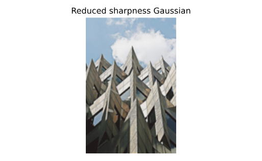

## Edge detection
In this exercise, you'll detect edges in an image by applying the Sobel filter.


Image preloaded as `soaps_image`.

The `show_image()` function has been already loaded for you.

Let's see if it spots all the figures in the image.

**Instructions**

- Import the `color` module so you can convert the image to grayscale.
- Import the `sobel()` function from `filters` module.
- Make `soaps_image` grayscale using the appropriate method from the `color` module.
- Apply the sobel edge detection filter on the obtained grayscale image `soaps_image_gray`.

``` python
# Import the color module
from skimage import color

# Import the filters module and sobel function
from skimage.filters import sobel

# Make the image grayscale
soaps_image_gray = color.rgb2gray(soaps_image)

# Apply edge detection filter
edge_sobel = sobel(soaps_image_gray)

# Show original and resulting image to compare
show_image(soaps_image, "Original")
show_image(edge_sobel, "Edges with Sobel")
```


> Great job! You succesfully detected the edges in the image. As you can see, the edges of all the figures in the scene are highlighted.

<br>

## Blurring to reduce noise
In this exercise you will reduce the sharpness of an image of a building taken during a London trip, through filtering.


Image loaded as `building_image`.

**Instructions**

- Import the Gaussian filter.
- Apply the filter to the `building_image`, set the multichannel parameter to the correct value.
- Show the original `building_image` and resulting `gaussian_image`.

``` python
# Import Gaussian filter 
from skimage.filters import gaussian

# Apply filter
gaussian_image = gaussian(building_image, multichannel=True)

# Show original and resulting image to compare
show_image(building_image, "Original")
show_image(gaussian_image, "Reduced sharpness Gaussian")
```



> Awesome! You have removed the excessive sharpness in the image.

<br>

## What's the contrast of this image?


The histogram tell us.

Just as we saw previously, you can calculate the contrast by calculating the **range** of the pixel intensities i.e. by subtracting the minimum pixel intensity value from the **histogram** to the maximum one.

You can obtain the maximum pixel intensity of the image by using the `np.max()` method from NumPy and the minimum with `np.min()` **in the console**.

The image has already been loaded as `clock_image`, NumPy as `np` and the `show_image()` function.

**Instructions**

- [ ] The contrast is 255 (high contrast).

- [x] The contrast is 148.

- [ ] The contrast is 189.

- [ ] The contrast is 49 (low contrast).

> Perfect! You calculated the range of the pixels intensities in the histogram, and so, the contrast of the image!

<br>

## Medical images
You are trying to improve the tools of a hospital by pre-processing the X-ray images so that doctors have a higher chance of spotting relevant details. You'll test our code on a chest X-ray image from the [National Institutes of Health Chest X-Ray Dataset](https://www.kaggle.com/datasets/nih-chest-xrays/data)


**_Image loaded as `chest_xray_image`._**

First, you'll check the histogram of the image and then apply standard histogram equalization to improve the contrast. Remember we obtain the histogram by using the `hist()` function from Matplotlib, which has been already imported as `plt`.

**Instructions**

1. Import the required Scikit-image module for contrast.
2. Show the histogram from the original x-ray image `chest_xray_image`, using the `hist()` function.
3. Use histogram equalization on `chest_xray_image` to obtain the improved image and load it as `xray_image_eq`.
4. Show the resulting improved image `xray_image_eq`.

``` python
# Import the required module
from skimage import exposure

# Show original x-ray image and its histogram
show_image(chest_xray_image, 'Original x-ray')

plt.title('Histogram of image')
plt.hist(chest_xray_image.ravel(), bins=256)
plt.show()

# Use histogram equalization to improve the contrast
xray_image_eq = exposure.equalize_hist(chest_xray_image)

# Show the resulting image
show_image(xray_image_eq, 'Resulting image')
```


> Great job! Now you can apply this code and knowledge to other similar images.

<br>

## Aerial image
In this exercise, we will improve the quality of an aerial image of a city. The image has low contrast and therefore we can not distinguish all the elements in it.


_Image loaded as `image_aerial`._

For this we will use the normal or standard technique of Histogram Equalization.

**Instructions**

- Import the required module from scikit-image.
- Use the histogram equalization function from the module previously imported.
- Show the resulting image.

``` python
# Import the required module
from skimage import exposure

# Use histogram equalization to improve the contrast
image_eq =  exposure.equalize_hist(image_aerial)

# Show the original and resulting image
show_image(image_aerial, 'Original')
show_image(image_eq, 'Resulting image')
```


> Awesome work! Now we can see more details of the objects in the image.

<br>

## Let's add some impact and contrast
Have you ever wanted to enhance the contrast of your photos so that they appear more dramatic?

In this exercise, you'll increase the contrast of a cup of coffee. Something you could share with your friends on social media. Don't forget to use #ImageProcessingDatacamp as hashtag!

Even though this is not our Sunday morning coffee cup, you can still apply the same methods to any of our photos.


A function called `show_image()`, that displays an image using Matplotlib, has already been defined. It has the arguments `image` and `title`, with `title` being `'Original'` by default.

**Instructions**

- Import the module that includes the Contrast Limited Adaptive Histogram Equalization (CLAHE) function.
- Obtain the image you'll work on, with a cup of coffee in it, from the module that holds all the images for testing purposes.
- From the previously imported module, call the function to apply the adaptive equalization method on the original image and set the clip limit to 0.03.

```python
# Import the necessary modules
from skimage import data, exposure

# Load the image
original_image = data.coffee()

# Apply the adaptive equalization on the original image
adapthist_eq_image = exposure.equalize_adapthist(original_image, clip_limit=0.03)

# Compare the original image to the equalized
show_image(original_image)
show_image(adapthist_eq_image, '#ImageProcessingDatacamp')
```


> Amazing! You have increased the contrast of the image using an algorithm for local contrast enhancement, that uses histograms computed over different tile regions of the image. Local details can therefore be enhanced even in regions that are darker or lighter than the rest of the image.

<br>

## Aliasing, rotating and rescaling
Let's look at the impact of aliasing on images.

Remember that aliasing is an effect that causes different signals, in this case pixels, to become indistinguishable or distorted.

You'll make this cat image upright by rotating it 90 degrees and then rescaling it two times. Once with the anti aliasing filter applied before rescaling and a second time without it, so you can compare them.


_Image preloaded as `image_cat`._

**Instructions** 

1. Import the module and the rotating and rescaling functions.
2. Rotate the image 90 degrees clockwise.
3. Rescale the `cat_image` to be 4 times smaller and apply the anti aliasing filter. Set whether or not the image should be treated as multichannel (colored).
4. Rescale the `rotated_cat_image` to be 4 times smaller without applying an anti aliasing filter.

``` python
# Import the module and the rotate and rescale functions
from skimage.transform import rotate, rescale

# Rotate the image 90 degrees clockwise 
rotated_cat_image = rotate(image_cat, -90)

# Rescale with anti aliasing
rescaled_with_aa = rescale(rotated_cat_image, 1/4, anti_aliasing=True, multichannel=True)

# Rescale without anti aliasing
rescaled_without_aa = rescale(rotated_cat_image, 1/4, anti_aliasing=False, multichannel=True)

# Show the resulting images
show_image(rescaled_with_aa, "Transformed with anti aliasing")
show_image(rescaled_without_aa, "Transformed without anti aliasing")
```


> Great job! You rotated and rescaled the image. Seems like the anti aliasing filter prevents the poor pixelation effect to happen, making it look better but also less sharp.

<br>

## Enlarging images
Have you ever tried resizing an image to make it larger? This usually results in loss of quality, with the enlarged image looking blurry.

The good news is that the algorithm used by scikit-image works very well for enlarging images up to a certain point.

In this exercise you'll enlarge an image **three times**!!

You'll do this by rescaling the image of a rocket, that will be loaded from the `data` module.


**Instructions**

- Import the module and function needed to enlarge images, you'll do this by rescaling.
- Import the data module.
- Load the rocket() image from data.
- Enlarge the rocket_image so it is 3 times bigger, with the anti aliasing filter applied. Make sure to set multichannel to True or you risk your session timing out!

``` python

```