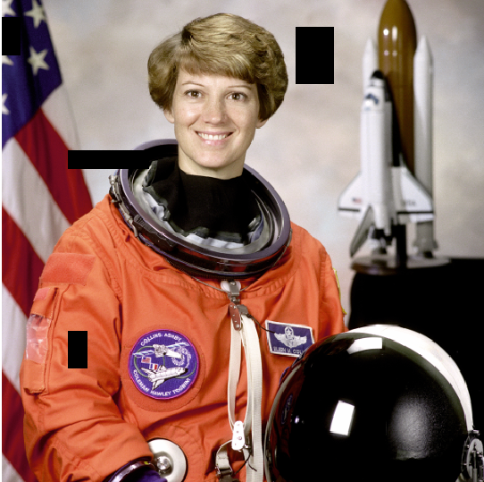
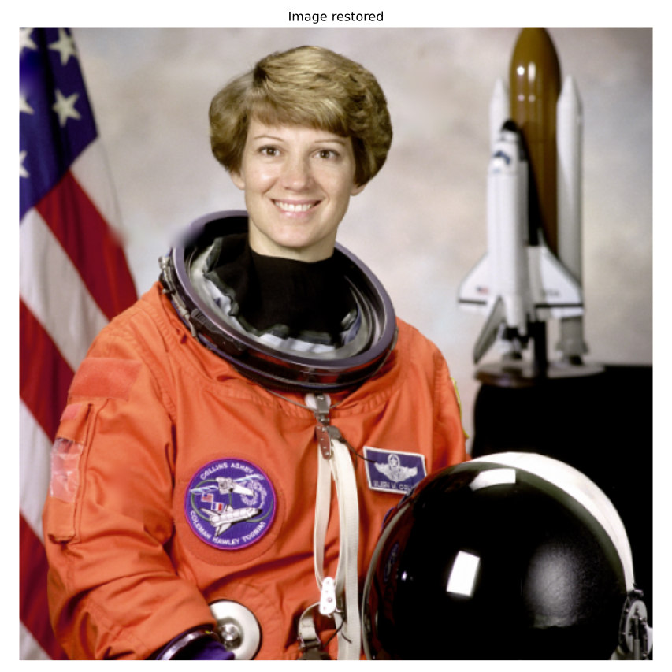
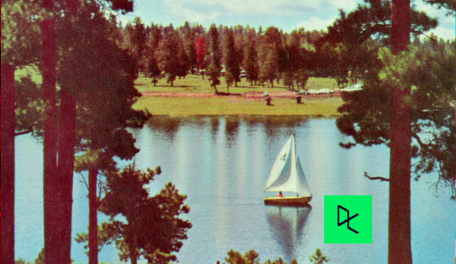

## Let's restore a damaged image
In this exercise, we'll restore an image that has missing parts in it, using the `inpaint_biharmonic()` function.



Loaded as `defect_image`.

We'll work on an image from the `data` module, obtained by `data.astronaut()`. Some of the pixels have been replaced with 0s using a binary mask, on purpose, to simulate a damaged image. Replacing pixels with 0s turns them totally black. The defective image is saved as an array called `defect_image`.

The mask is a black and white image with patches that have the position of the image bits that have been corrupted. We can apply the restoration function on these areas. This mask is preloaded as `mask`.

Remember that inpainting is the process of reconstructing lost or deteriorated parts of images and videos.

**Instructions**

1. Import the inpaint function in the restoration module in scikit-image (skimage).
2. Show the defective image using `show_image()`.
3. Call the correct function from `inpaint`. Use the corrupted image as the first parameter, then the mask and multichannel boolean.

``` python
# Import the module from restoration
from skimage.restoration import inpaint

# Show the defective image
show_image(defect_image, 'Image to restore')

# Apply the restoration function to the image using the mask
restored_image = inpaint.inpaint_biharmonic(defect_image, mask, multichannel=True)
show_image(restored_image)
```



> Hurray! You restored the image successfully. The image looks a lot better now. You can handle colored images that have several missing areas.

<br>

## Removing logos
As we saw in the video, another use of image restoration is removing objects from an scene. In this exercise, we'll remove the Datacamp logo from an image.



Image loaded as `image_with_logo`.

You will create and set the mask to be able to erase the logo by inpainting this area.

Remember that when you want to remove an object from an image you can either manually delineate that object or run some image analysis algorithm to find it.

Instructions
100 XP
Initialize a mask with the same shape as the image, using np.zeros().
In the mask, set the region that will be inpainted to 1 .
Apply inpainting to `image_with_logo` using the mask.