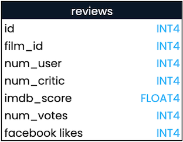

## Learning to COUNT()
You saw how to use `COUNT()` in the video. Do you remember what it returns?

Here is a query counting `film_id`. Select the answer below that correctly describes what the query will return.

``` sql
SELECT COUNT(film_id) AS count_film_id
FROM reviews;
```

Run the query in the console to test your theory!

- [ ] The number of unique films in the reviews table.
- [x] The number of records containing a film_id.
- [ ] The total number of records in the reviews table.
- [ ] The sum of the film_id field.

<br>

## Practice with COUNT()
As you've seen, `COUNT(*)` tells you how many records are in a table. However, if you want to count the number of non-missing values in a particular field, you can call `COUNT()` on just that field.

Let's get some practice with `COUNT()`! You can look at the data in the tables throughout these exercises by clicking on the table name in the console.

**Instructions**

1. Count the total number of records in the `people` table, aliasing the result as `count_records`.

``` sql
SELECT COUNT(*) AS count_records
FROM people;
```

2. Count the number of records with a birthdate in the `people` table, aliasing the result as `count_birthdate`.

``` sql
SELECT COUNT(birthdate) AS count_birthdate
FROM people;
```

3. Count the records for languages and countries in the `films` table; alias as `count_languages` and `count_countries`.

``` sql
SELECT COUNT(language) AS count_languages, COUNT(country) AS count_countries
FROM films;
```

<br>

## SELECT DISTINCT
Often query results will include many duplicate values. You can use the `DISTINCT` keyword to select the unique values from a field.

This might be useful if, for example, you're interested in knowing which languages are represented in the `films` table. See if you can find out what countries are represented in this table with the following exercises.

**Instructions**

1. Return the unique countries represented in the `films` table using `DISTINCT`.

``` sql
SELECT DISTINCT country
FROM films;
```

2. Return the number of unique countries represented in the `films` table, aliased as `count_distinct_countries`.

``` sql
SELECT COUNT(DISTINCT country) as count_distinct_countries
FROM films;
```

<br>

## Order of execution
SQL code is processed differently than other programming languages in that you need to let the processor know where to pull the data from before making selections.

It's essential to know your code's order of execution compared to the order it is written in to understand what results you'll get from your query and how to fix any errors that may come up.

**Instructions**

Drag the SQL keywords into the order that they will be executed in (not the written order) from first (top) to last (bottom).

1. `FROM`
2. `SELECT`
3. `LIMIT`

<br>

## Debugging errors
Debugging is an essential skill for all coders, and it comes from making many mistakes and learning from them.

In this exercise, you'll be given some buggy code that you'll need to fix.

**Instructions**

1. Debug and fix the SQL query provided.

``` sql
SELECT certification
FROM films
LIMIT 5;
```

2. Find the two errors in this code; the same error has been repeated twice.

``` sql
SELECT film_id, imdb_score, num_votes
FROM reviews;
```

3. Find the two bugs in this final query.

``` sql
SELECT COUNT(birthdate) AS count_birthdays
FROM people;
```

<br>

## SQL best practices
SQL style guides outline standard best practices for writing code.

This exercise will present several SQL style tips. Your job will be to decide whether they are considered best practices.

We'll be following Holywell's style guide.

**Instructions**

Drag and drop the items into the correct zone.

| Best Practice | Poor Practice |
| ------------- | ------------- |
| Capitalize keywords | Don't capitalize keywords |
| End queries with a semicolon | Write lots of queries with no semicolon |
| Use underscores in field names rather than spaces | Write the query on one line |

<br>

## Formatting
Readable code is highly valued in the coding community and professional settings. Without proper formatting, code and results can be difficult to interpret. You'll often be working with other people that need to understand your code or be able to explain your results, so having a solid formatting habit is essential.

In this exercise, you'll correct poorly written code to better adhere to SQL style standards.

**Instructions**

Adjust the sample code so that it is in line with standard practices.

``` sql
SELECT person_id, role
FROM roles
LIMIT 10;
```

<br>

## Non-standard fields
You may occasionally receive a dataset with poorly named fields. Ideally, you would fix these, but you can work around it with some added punctuation in this instance.

A sample query and schema have been provided; imagine you need to be able to run it with a non-standard field name. Select the multiple-choice answer that would correctly fill in the blank to return both a film's id and its number of Facebook likes for all reviews. Select one answer:

```
SELECT film_id, ___
FROM reviews;
```



- [ ] facebook likes
- [x] "facebook likes"
- [ ] facebook, likes
