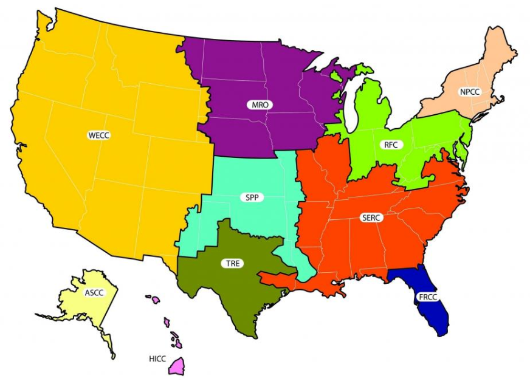

## Summing
Summing and counting are key ways of aggregating data, regardless of whether you are using a database, manipulating a spreadsheet, or using a programming language such as Python or R. Let's see how to do it in T-SQL using the `grid` table from Chapter 1.

You'll start by obtaining overall sums, focusing specifically on the `'MRO'` region.



**Instructions**

Obtain a grand total of the `demand_loss_mw` column by using the `SUM` function, and alias the `result` as `MRO_demand_loss`.
Only retrieve rows `WHERE` `demand_loss_mw` is _not_ `NULL` **and** `nerc_region` is [`'MRO'`](https://en.wikipedia.org/wiki/Midwest_Reliability_Organization).

``` sql
SELECT 
  SUM(demand_loss_mw) AS MRO_demand_loss 
FROM 
  grid 
WHERE
  demand_loss_mw IS NOT NULL
  AND
  nerc_region = 'MRO';
```

<br>

## Counting
Having explored the `'MRO'` region, let's now explore the [`'RFC'`](https://en.wikipedia.org/wiki/ReliabilityFirst) region in more detail while learning how to use the `COUNT` aggregate function.


**Instructions**

1. Return the `COUNT` of the `grid_id` column, aliasing the result as `grid_total`.

``` sql
SELECT 
  COUNT(grid_id) as grid_total 
FROM 
  grid;
```

2. Make the count more meaningful by restricting it to records where the `nerc_region` is `'RFC'`. Name the result `RFC_count`.

``` sql
SELECT 
  COUNT(grid_id) as RFC_count 
FROM 
  grid;
WHERE
  nerc_region = 'RFC'
```

<br>

## MIN, MAX and AVG
Along with summing and counting, you'll frequently need to find the minimum, maximum, and average of column values. Thankfully, T-SQL has functions you can use to make the task easier!

**Instructions**

1. Find the minimum value from the `affected_customers` column, but only for rows where `demand_loss_mw` has a value. Name the result `min_affected_customers`.

``` sql
SELECT 
  MIN(affected_customers) AS affected_customers 
FROM 
  grid
WHERE
  demand_loss_mw IS NOT NULL;
```

2. Amend the query to return the maximum value from the same column, this time aliasing as `max_affected_customers`.

``` sql
SELECT 
  MAX(affected_customers) AS max_affected_customers 
FROM 
  grid
WHERE
  demand_loss_mw IS NOT NULL;
```

3. Return the average value from the `affected_customers` column, this time aliasing as `avg_affected_customers`.

``` sql
SELECT 
  AVG(affected_customers) AS avg_affected_customers 
FROM 
  grid
WHERE
  demand_loss_mw IS NOT NULL;
```

<br>

## LEN'gth of a string
Knowing the length of a string is key to being able to manipulate it further using other functions, so what better way to start the lesson?

**Instructions**

Retrieve the length of the `description` column, returning the results as `description_length`.

``` sql
SELECT 
  LEN(description) AS description_length
FROM 
  grid;
```

<br>

## Left and right
We can retrieve portions of a string from either the start of the string, using `LEFT`, or working back from the end of the string, using `RIGHT`.

**Instructions**

1. Retrieve the first `25` characters from the `description` column in the grid table. Name the results `first_25_left`.

``` sql
SELECT 
  LEFT(description, 25) AS first_25_left 
FROM 
  grid;
```

2. Amend the query to retrieve the last `25` characters from the `description`. Name the results `last_25_right`.

``` sql
SELECT 
  RIGHT(description, 25) AS last_25_right 
FROM 
  grid;
```

<br>

## Stuck in the middle with you
You might be fortunate, and find that the interesting parts of your strings are at either end. However, chances are, you'll want to retrieve characters from somewhere around the middle. Let's see how to use `RIGHT`, `LEN`, `CHARINDEX` AND `SUBSTRING` to extract the interior portion of a text string. The `description` column can contain multiple reasons for power outages in each row. We want to extract any additional causes of outage whenever `Weather` appears in the description column.

**Instructions**

1. You can use `CHARINDEX` to find a specific character or pattern within a column. Edit the query to return the `CHARINDEX` of the string `'Weather'` whenever it appears within the `description` column.

``` sql
SELECT 
  description, 
  LEN('Weather', description) 
FROM 
  grid
WHERE description LIKE '%Weather%';
```

2. We now know where `'Weather'` begins in the description column. But where does it end? We could manually count the number of characters, but, for longer strings, this is more work, especially when we can also find the length with `LEN`.

``` sql
SELECT 
  description, 
  CHARINDEX('Weather', description),
  LEN(description)
FROM 
  grid
WHERE description LIKE '%Weather%';
```

3. Now we use `SUBSTRING` to return everything after Weather for the first ten rows. The start index here is 15, because the `CHARINDEX` for each row is 8, and the `LEN` of Weather is 7.

``` sql
SELECT TOP(10)
  description, 
  CHARINDEX('Weather', description),
  LEN('Weather'),
  SUBSTRING(
    description,
    15,
    LEN(description)
  )
FROM 
  grid
WHERE description LIKE '%Weather%';
```

<br>

## GROUP BY
In an earlier exercise, you wrote a separate `WHERE` query to determine the amount of demand lost for a specific region. We wouldn't want to have to write individual queries for every region. Fortunately, you don't have to write individual queries for every region. With `GROUP BY`, you can obtain a sum of all the unique values for your chosen column, all at once.

You'll return to the `grid` table here and calculate the total lost demand for all regions.

**Instructions**

- Select `nerc_region` and the sum of `demand_loss_mw` for each region.
- Exclude values where `demand_loss_mw` is `NULL`.
- Group the results by `nerc_region`.
- Arrange in descending order of `demand_loss`.

``` sql
SELECT 
  nerc_region,
  SUM(demand_loss_mw) AS demand_loss
FROM 
  grid
WHERE 
  demand_loss_mw IS NOT NULL
GROUP BY
  nerc_region
ORDER BY 
  demand_loss DESC;
```

<br>

## Having
`WHERE` is used to filter rows before any grouping occurs. Once you have performed a grouping operation, you may want to further restrict the number of rows returned. This is a job for `HAVING`. In this exercise, you will modify an existing query to use `HAVING`, so that only those results with a sum of over 10000 are returned.

**Instructions**

- Modify the provided query to remove the `WHERE` clause.
- Replace it with a `HAVING` clause so that only results with a total `demand_loss_mw` of greater than 10000 are returned.

``` sql
SELECT 
  nerc_region, 
  SUM (demand_loss_mw) AS demand_loss 
FROM 
  grid
GROUP BY 
  nerc_region
HAVING 
  SUM(demand_loss_mw) > 10000 
ORDER BY 
  demand_loss DESC;
```

<br>

## Grouping together
In this final exercise, you will combine `GROUP BY` with aggregate functions such as `MIN` that you've seen earlier in this chapter.

To conclude this chapter, we'll return to the eurovision table from the first chapter.

**Instructions**

1. Use `MIN` and `MAX` to retrieve the minimum and maximum values for the place and points columns respectively.

``` sql
SELECT 
  MIN(place) AS hi_place, 
  MAX(place) AS lo_place, 
  MIN(points) AS min_points, 
  MAX(points) AS max_points 
FROM 
  eurovision;
```

2. Let's obtain more insight from our results by adding a `GROUP BY` clause. Group the results by `country`.

``` sql
SELECT 
  MIN(place) AS hi_place, 
  MAX(place) AS lo_place, 
  MIN(points) AS min_points, 
  MAX(points) AS max_points 
FROM 
  eurovision;
GROUP BY 
  country;
```

3. The previous query results did not identify the country. Let's amend the query, returning the count of entries per country and the country column. Complete the aggregate section by finding the average place for each country.

``` sql
SELECT 
  COUNT(country),
  country,
  AVG(place)
  MIN(place) AS hi_place, 
  MAX(place) AS lo_place, 
  MIN(points) AS min_points, 
  MAX(points) AS max_points 
FROM 
  eurovision;
GROUP BY 
  country;
```

4. Finally, our results are skewed by countries who only have one entry. Apply a filter so we only return rows where the `country_count` is greater than 5. Then arrange by `avg_place` in ascending order, and `avg_points` in descending order.

``` sql
SELECT 
  COUNT(country),
  country,
  AVG(place) AS avg_place
  AVG(points) AS avg_points
  MIN(place) AS hi_place, 
  MAX(place) AS lo_place, 
  MIN(points) AS min_points, 
  MAX(points) AS max_points 
FROM 
  eurovision;
GROUP BY 
  country
ORDER BY
  avg_place ASC,
  avg_points DESC;
```
