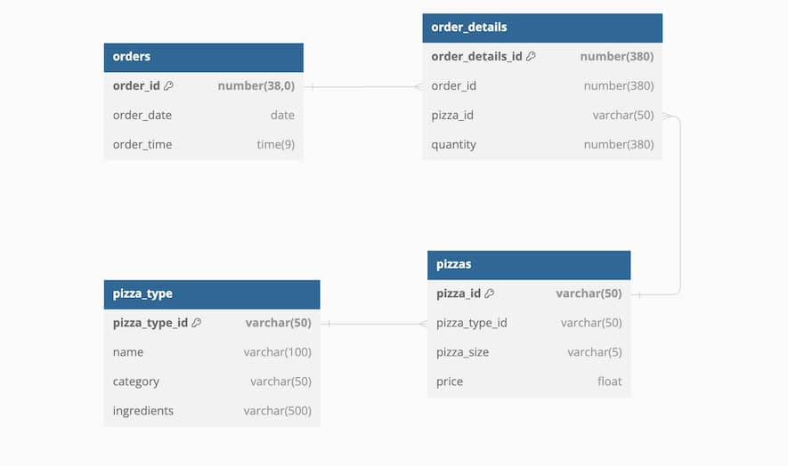

## NATURAL JOIN
Pissa, the ever-expanding pizza delivery enterprise, has a new challenge for you. They're interested in discovering which type of pizza generates the most revenue.

Identify the top-selling pizza category using your knowledge on `NATURAL JOIN`.

Here is the `pizza` schema for your reference:



**Instructions**

Calculate `total_revenue` based on `SUM` of `price * quantity`; taking `price` from `p` (`pizzas`) and `quantity` from `od` (`order_details`) table.
NATURAL JOIN the `pizzas` and `pizza_type` tables.
GROUP the records by `category` from `pt` (`pizza_type`) table.
ORDER the details by `total_revenue` in descending order and LIMIT to 1 to fetch only the top revenue pizza.

``` sql
SELECT 
    pt.category,
    SUM(p.price * od.quantity) AS total_revenue
FROM order_details AS od
NATURAL JOIN pizzas AS p 
NATURAL JOIN pizza_type AS pt
GROUP BY pt.category
ORDER BY total_revenue DESC
LIMIT 1
```

> Great work! You've mastered the intricacies of `NATURAL JOIN` and provided valuable insights for optimizing a business's marketing strategy. Keep it up!

<br>

## The world of JOINS
As a consulting data engineer, Pissa now wants your advanced Snowflake SQL skills to get some insights in their sales and revenue.

Apply your knowledge on Joins to get the desired result.

**Instructions**

1. Ensure that all orders from the orders table are included in the result, regardless of whether they have corresponding entries in the `order_details` table.
2. 
3. 

> 

<br>

## 

> 

<br>

## 

> 

<br>

