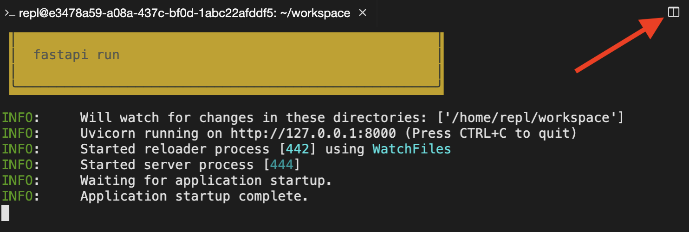

## First application
Let's run the FastAPI server for the first time! You can't run the FastAPI server directly with "Run this file" - see the instructions for how to run and stop the server from the terminal.

**Ide Exercise Instruction**

- Run the live server in the bash repl (the terminal at the bottom): fastapi dev main.py.
- Verify the logs in the terminal show Application startup complete..
- Stop the live server by pressing Control+C.

``` 
fastapi dev main.py
```

> Great work! You've run your first FastAPI application. Now you can learn how to build API endpoints that manage and transmit structured data.

<br>

## FastAPI vs. Django
Classify the features of FastAPI and Django to show their strengths and limitations.

**Instructions**

Drag each feature to the correct web framework.

| FastAPI | Django |
| ------- | ------ |
| ORM optional | ORM built-in |
| Build APIs | Build web-based (GUI) apps |

> Congratulations! You understand the key differences between FastAPI and Django.

<br>

## Hello world
Let's build your first GET endpoint! You can't run the FastAPI server directly with "Run this file" - see the instructions for how to run and stop the server from the terminal.

**Ide Exercise Instruction**

- Import FastAPI and instantiate the app server.
- Run the live server in the terminal: fastapi dev main.py.
- Open a new terminal (top-right of terminal)

- Terminal with arrow pointing to the "new terminal" button on top right.
- Test your code with the following command:
```
curl http://localhost:8000
```

``` python
from fastapi import FastAPI

app = FastAPI()


@app.get("/")
def root():
    return {"message": "Hello World"}
```

```
fastapi dev main.py

curl http://localhost:8000
```

> Great work! You've built your first FastAPI GET endoint.

<br>

## Hello who?
Let's build your first GET endpoint that accepts an input! You can't run the FastAPI server directly with "Run this file" - see the instructions for how to run and stop the server from the terminal.

**Ide Exercise Instruction**

- Add a query parameter name with a default value "Alan".-
- Return a dictionary with the key message and the value "Hello {name}".-
- Run the live server in the terminal: fastapi dev main.py.-
- Open a new terminal (top-right of terminal) and test your code with the following command:
```
curl \
  -H 'Content-Type: application/json' \
  http://localhost:8000?name=Steve
```

``` python
from fastapi import FastAPI

app = FastAPI()


@app.get("/")
def root(name: str = "Alan"):
    return {"message": f"Hello {name}"}
```

```
fastapi dev main.py

curl \
  -H 'Content-Type: application/json' \
  http://localhost:8000?name=Steve
```

> Great work! You've built your first FastAPI GET endoint that accepts an input.

<br>

## Pydantic model
You've been asked to create an API endpoint that manages items in inventory. To get started, create a Pydantic model for `Items` that has attributes `name`, `quantity`, and `expiration`.

**Instructions**

- Import date from datetime and BaseModel from pydantic.
- Create a Pydantic model for `Item`.
- Fill in the following fields correctly: `name` (string), `quantity` (integer, optional, default 0), and `expiration` (date, optional, default None).

``` python
from datetime import date

from pydantic import BaseModel

class Item(BaseModel):
    name: str
    quantity: int = 0
    expiration: date = None
```

> Great work! You've created and tested your first Pydantic model. Now you can build endpoints that accept your model as input and/or return your model as output.

<br>

## POST operation in action
You've been asked to create an API endpoint that accepts a `name` parameter and returns a message saying "We have `name`". To accomplish this, create a Pydantic model for `Item` and root endpoint (`/`) that serves HTTP POST operations. The endpoint should accept the `Item` model as input and respond with a message including `Item.name`.

You can't run the FastAPI server directly with "Run this file" - see the instructions for how to run the server and test your code from the terminal.

**Ide Exercise Instruction**

- Define pydantic model `Item` so that parameter `name` can be passed into the POST body.
- Run the live server in the terminal: `fastapi dev main.py`
- Open a new terminal (top-right of terminal) and test your code with the following command:

```
curl -X POST \
  -H 'Content-Type: application/json' \
  -d '{"name": "bananas"}' \
  http://localhost:8000
```

``` python
from fastapi import FastAPI
from pydantic import BaseModel

class Item(BaseModel):
    name: str

app = FastAPI()


@app.post("/")
def root(item: Item):
    name = item.name
    return {"message": f"We have {name}"}
```

```
fastapi dev main.py

curl -X POST \
  -H 'Content-Type: application/json' \
  -d '{"name": "bananas"}' \
  http://localhost:8000
```

> Great work! You've created and tested your first POST endpoint. Now you can build endpoints that traditionally create new objects and can functionally accept virtually limitless input data.
