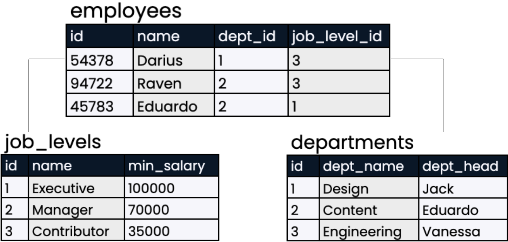
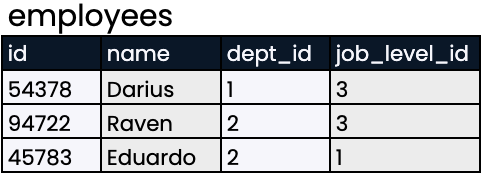
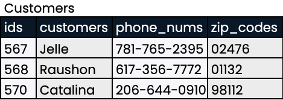
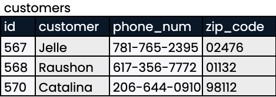

## What are the advantages of databases?
Which of the following are advantages of storing data in a database, rather than using traditional formats like spreadsheets? Select one answer.

- [ ] More storage
- [ ] Many people can use at once
- [ ] Can be secured with encryption
- [x] All of the above

<br>

## Data organization
Understanding the organization of a database is an important first step when using SQL.

Take a look at the database below. Which of the following statements correctly describes its organization? Select one answer.


- [ ] This is a table containing three relational databases: `employees`, `job_levels`, and `departments`.
- [x] This is a relational database containing three tables: `employees`, `job_levels`, and `departments`.
- [ ] This is a database, but it is not relational, because no relationship exists between job levels and departments.
- [ ] This is not a database because there is no SQL code shown.

<br>

## Picking a unique ID
A unique identifier is a value that distinguishes a record from others in the same table.

In the employees table, which fields do you believe is the most suitable choice for a unique identifier? Select one answer


- [ ] name
- [ ] dept_id
- [ ] year_hired
- [x] id

<br>

## Setting the table in style
Here are two versions of a table taken from a database.

Which table uses the correct naming format? Select one answer

- [ ] 
- [x] 

<br>

## Our very own table
Our very own table
A database has been set up for this course and the `books` table is available here.

Run the code to explore what data `books` holds!

**Instructions**

Hit "Run Code" to see the `books` table.

``` sql
SELECT * FROM books;
```

<br>

## At your service
Now that you know more about how data is stored, it's time to test those skills!

Select the statement about database storage that is _false_. Select one answer

- [ ] Servers can be used for storing website information as well as databases.
- [ ] A server can handle requests from many computers at once.
- [x] Servers are usually personal computers such as laptops.
- [ ] Data from a database is physically stored on a server.

<br>

## Finding data types
Imagine that you are starting a new job and have just started getting to know your new employer's database. You know that it's important to know the data type—such as `VARCHAR`, `INT`, or `NUMERIC`—corresponding to each field in a table. Where could you find this information? Select one answer

- [ ] You can find this information by looking at each table in the database.
- [ ] You can find this information by looking at a diagram of relationships between tables.
- [ ] You can find this information by looking at the values in each field for each table.
- [x] You can find this information by looking at a database schema.

<br>

## Choice of type
When creating a table, its important to specify the appropriate data type for each field to make sure it is stored correctly and that relevant operations are enabled.

Let's practice selecting the correct data types for your data!

**Instructions**

Sort each item into the correct data type.

| VARCHAR | INT | NUMERIC |
| ------- | --- | ------- |
| Phone number such as 321-123-5555 | Number of mailing list subscribers such as 9782 | Weight in tons such as 5.67 |
| Product reviews written by customers | Model year such as 2004 | Product prices in dollars such as 63.75 |
