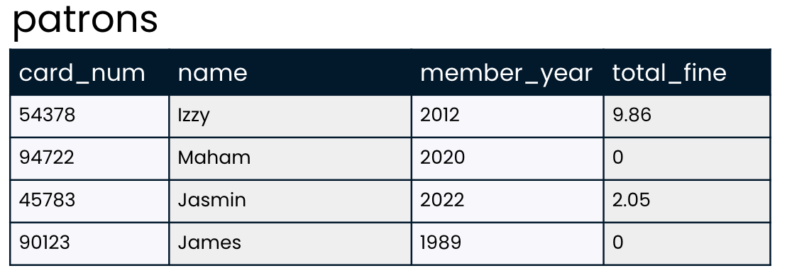

## SQL strengths
Which of the below scenarios describes a situation in which using SQL would be useful? Select one answer

- [ ] All data needed to answer the business question is presented in a spreadsheet, and no complicated relationships exist between different data points.
- [x] Large amounts of data about many different but related areas of a business are housed in a relational database.
- [ ] The data needed to answer the business question doesn't exist yet.

<br>

## Developing SQL style
Recall from the video that it's important to pay attention to the formatting of SQL queries in order to make them readable. This is especially helpful as you learn more keywords and your queries get longer.

In this exercise, you'll review the below query about the `patrons` table. This code _will_ run properly, but it is messy and hard to read. Your task is to determine which edits are appropriate to improve the query so that it follows best practices for SQL style.

``` sql
SELECT CARD_NUM, TOTAL_FINE 
from patrons;
```

Here's a reminder about what the `patrons` table looks like!



**Instructions**

Drag each suggestion to the proper zone depending on whether or not it will improve the query's style.

| Make suggestion | Don't make suggestion |
| --------------- | --------------------- |
| make `CARD_NUM` and `TOTAL_FINE` lowercase | Capitalize `patrons` |
| Capitalize `from` | Make `SELECT` lowercase |
| Add a `;` at the end of the query | All code should be just one line |

<br>

## Querying the books table
You're ready to practice writing your first SQL queries using the `SELECT` and `FROM` keywords. Recall from the video that `SELECT` is used to choose the fields that will be included in the result set, while `FROM` is used to pick the table in which the fields are listed.

Feel free to explore `books` in the exercise.

Your task in this exercise is to practice selecting fields from `books`.

**Instructions**
1. Use SQL to return a result set of all book titles included in the `books` table.

``` sql
SELECT title
FROM books;
```

2. Select both the `title` and `author` fields from `books`.

``` sql
SELECT title, author
FROM books;
```

3. Select all fields from the `books` table.

``` sql
SELECT *
FROM books;
```

<br>

## Making queries DISTINCT
You've learned that the `DISTINCT` keyword can be used to return unique values in a field. In this exercise, you'll use this understanding to find out more about the `books` table!

There are 350 books in the `books` table, representing all of the books that our local library has available for checkout. But how many different authors are represented in these 350 books? The answer is surely less than 350. For example, J.K. Rowling wrote all seven Harry Potter books, so if our library has all Harry Potter books, seven books will be written by J.K Rowling. There are likely many more repeat authors!

**Instructions**
1. Write SQL code that returns a result set with just one column listing the unique authors in the `books` table.

``` sql
SELECT DISTINCT author
FROM books;
```

2. Update the code to return the unique `author` and `genre` combinations in the `books` table.

``` sql
SELECT DISTINCT author, genre
FROM books;
```

<br>

## Aliasing
While the default column names in a SQL result set come from the fields they are created from, you've learned that aliasing can be used to rename these result set columns. This can be helpful for clarifying the intent or contents of the column.

Your task in this exercise is to incorporate an alias into one of the SQL queries that you worked with in the previous exercise!

**Instructions**
Add an alias to the SQL query to rename the `author` column to `unique_author` in the result set.

``` sql
SELECT DISTINCT author AS unique_author
FROM books;
```

<br>

## VIEWing your query
You've worked hard to create the below SQL query:
``` sql
SELECT DISTINCT author AS unique_author
FROM books;
```
What if you'd like to be able to refer to it later, or allow others to access and use the results? The best way to do this is by creating a view. Recall that a view is a virtual table: it's very similar to a real table, but rather than the data itself being stored, the query code is stored for later use.

**Instructions**
1. Add a single line of code that saves the results of the written query as a view called `library_authors`.

``` sql
CREATE VIEW library_authors AS
SELECT DISTINCT author AS unique_author
FROM books;
```

2. Check that the view was created by selecting all columns from `library_authors`.

``` sql
SELECT *
FROM library_authors
```

<br>

## Comparing flavors
The video introduced several differences between SQL Server and PostgreSQL. These are just two of many relational database systems available, but the differences are fairly representative of the types of differences you'll see between other SQL database systems and flavors as well.

**Instructions**
Drag the statement to the database management system that it correctly describes.

| PostgreSQL | SQL Server |
| ---------- | ---------- |
| Developed at University of California, Berkeley | Has both free and enterprise versions |
| Research funds provided by DARPA | Created by Microsoft |
| Free and open source | Queried using T-SQL |

<br>

## Limiting results
Let's take a look at a few of the genres represented in our library's books.

Recall that limiting results is useful when testing code since result sets can have thousands of results! Queries are often written with a `LIMIT` of just a few records to test out code before selecting thousands of results from the database.

Let's practice with `LIMIT`!

**Instructions**

Using PostgreSQL, select the `genre` field from the `books` table; limit the number of results to 10.

``` sql
SELECT genre
FROM books
LIMIT 10;
```

<br>

## Translating between flavors
In the previous exercise, you wrote the following code using PostgreSQL:

``` sql
SELECT genre
FROM books
LIMIT 10;
```

The database in this course is a PostgreSQL database, so you won't be able to run SQL Server code in any of the exercises. What if you did want to update the above query to work with SQL Server, though? How would you do that? Select one answer

- [ ] Replace `FROM` with `TABLE`
- [ ] Replace `SELECT`, `FROM`, and `LIMIT` with the corresponding SQL Server keywords
- [x] Remove `LIMIT` statement and add `TOP(10)` after `SELECT`
- [ ] Replace `LIMIT` with `TOP` and remove the ; at the end of the query
