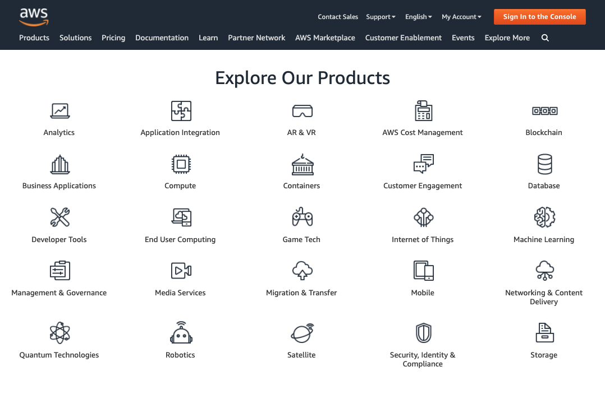

## Understanding the cloud
You may have heard of the cloud in the context of storing your photos and videos online, but cloud computing is more than that. It is part of a business model that is becoming increasingly popular with more and more companies moving their workloads to the cloud.

In the video, we introduced you to the world of cloud computing. Let's see how well you understand what it encompasses.

**_Which statement about cloud computing is FALSE?_** Select one answer.

- [ ] Cloud adoption has been going up over the past years and is predicted to grow even further in the near future.
- [x] A cloud solution is always better than an on-premise solution.
- [ ] You can build and deploy custom AI models in the cloud.
- [ ] A server is a powerful computer that you can connect into remotely.

> Perfect! You're right, this statement is false. Some use cases require an on-premise solution. You'll learn more about this in the next video.

 

## Cloud vs. on-premise
The cloud is transforming the way organizations use computer services. Where in the past you had to own local servers and systems, in the cloud they are managed by an external provider that charges you for the use. Let's see if you know the difference.

**Instructions**

Arrange the statements based on the IT infrastructure model that it suits best.

Claro! Aqui está a tabela em Markdown com base nas informações da imagem:

Here's the table in English:

| On-premise | Cloud computing |
| ---------- | --------------- |
| It can take a long time to set up a new server | Can deal with high website traffic efficiently |
| You will pay for the server even when you are not using it | You have access to additional computing power instantly |
| The servers are located within the physical confines of the company | It’s easy to scale up or down based on your needs |

> Awesome! You have a good idea of the difference between cloud and on-premises server solutions. Remember that no one solution is better than the other and that the ideal IT infrastructure model depends on your use case. We'll learn more about this in the next video.

 

## Cloud computing services
Cloud providers like AWS, Microsoft Azure, and Google Cloud offer a wide variety of services. Below you can find an overview of the products available on AWS.

Which service is included in the AWS offer? Select one answer.

Compute
Machine Learning
Game Tech
All of the above

> Perfect! The services offered by AWS cover a wide variety of areas and they are expanding continuously. You'll see that other cloud providers will have a similar offer, more on that in chapter 3.

 

## Primary cloud services
Cloud providers like AWS, Microsoft Azure, and Google Cloud offer a wide variety of services. The three basic ones, which you will be able to find for every cloud provider, are:

- Compute
- Storage
- Databases

It's important to understand what the resources provided by this service are responsible for.

**Instructions**

Match the description to the corresponding cloud service.

Here's the table in Markdown format based on the information in the image:

| Compute | Storage | Databases |
| ------- | ------- | --------- |
| These resources provide the brains that will process your workload | These resources help you save and store data, like images and text files | These resources help you store more structured sets of data, like tables |

> Congrats! You now know what the primary cloud services are. On top of these basic ones, you'll find a long list of other services offered by different cloud providers. You can take a look at their respective websites to see what they offer if you're curious.

 

## Key characteristics
Cloud computing services provide more possibilities for organizations all over the world. These services share certain characteristics that make them very powerful. Time to check how well you understand them!

**Instructions**

Identify the statements as true or false.

Here's the table in Markdown format based on the information in the image:

| True | False |
| ---- | ----- |
| Most on-premise data centers have a hard time competing with the cloud providers' network of data centers in terms of performance | Storing your data on the cloud is not secure at all |
| Virtualization splits one physical server into multiple virtual servers, allowing for a more efficient use of the physical resources available | If a hurricane destroys the cloud data center where your data is stored, you lose everything |
| On-demand resourcing means that resources are available to you immediately when you need them | A cloud solution is always the cheapest option when the resources you need are clear and stable over time |

> Amazing! These key characteristics make the cloud the powerful technology that it is today.

 

## Outsourcing IT services
Cloud computing is offered in three different service models each satisfying a unique set of business requirements. It's important to understand what each model offers. There are three main service models:

- **Infrastructure as a Service (IaaS)** - offers cloud infrastructure
- **Platform as a Service (PaaS)** - offers infrastructure and software for application development
- **Software as a Service (SaaS)** - offers ready-to-use applications in the cloud

**Instructions**

For each feature, select the lowest-tier service model where the cloud provider manages that feature.

For example, for "Networking", the correct answer would be "IaaS". Networking is included in IaaS, PaaS, and SaaS, but IaaS is the lowest-tier service model.

| IaaS | PaaS | SaaS |
| ---- | ---- | ---- | 
| Storage | Runtime | Applications |
| Servers | Operating System | Data |

> Well done! This is exactly what each of these models offer. You can see that the the best solution depends on your specific business needs.

 

## IaaS, PaaS, or SaaS?
You proved that you know what is offered in each of these service models, but it's also important to know when to use which one. They all have their own strengths and it is necessary to understand the differences among SaaS, PaaS, and IaaS to know how to best choose one for your organization.

**Instructions**

Classify each statement under the service model it describes best.

| IaaS | PaaS | SaaS |
| ---- | ---- | ---- |
| Mostly used by system admins | Mostly used by developers | Mostly used by end customers |
| Use case: Improve the capacity of your data center for unpredictable workloads | Use case: reduce the costs of application development | Use case: transitioning from internally hosted Exchange email to a cloud-based corporate email tool |

> Fantastic! You know the differences between these three cloud service models. You saw that the model depends on the use case. This is why most organizations use a combination of IaaS, PaaS, and SaaS.

 

## Level of abstraction
Cloud service models can be ordered in terms of abstraction. Abstraction refers to the act of offering essential features without including the background details.

Let's take a look at the three models from before - IaaS, PaaS, and SaaS - as well as a fourth one, FaaS (Function as a Service). Can you order the cloud service models based on their level of abstraction? The model with the highest level of abstraction should come first.

**Instructions**

Order the cloud service models based on their level of abstraction. The highest level of abstraction should be at the top.

1. Software as a Service
2. Function as a Service
3. Platform as a Service
4. Infraestructure as a Service

> Excellent! Over the past years more and more functionality is being abstracted away from the end user, and offered as a cloud service package.
