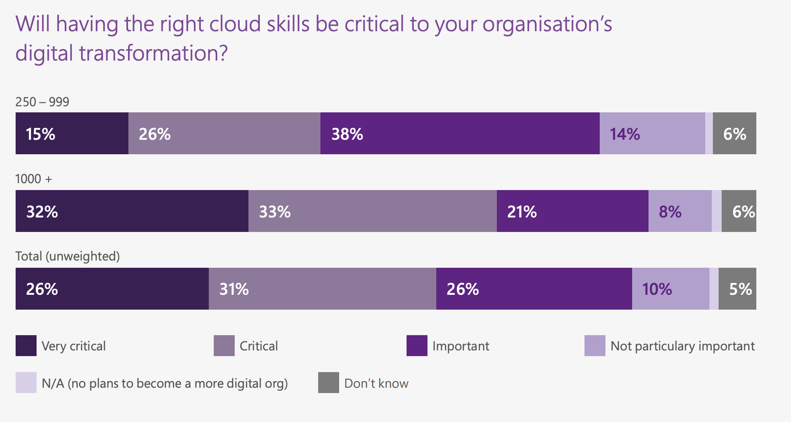

## Private or public?
In terms of cloud deployment models, the private model and the public model are on the opposite ends of the spectrum. Therefore, it's crucial to understand the difference between the two. If you know the strengths and drawbacks of each, then you can better decide on the best deployment model for a given use-case, even if it's something in between like the hybrid, community, or multicloud model!

**Instructions**

Classify the statements into the model that it best describes.

| Private Model | Public Model |
| ------------- | ------------ |
| Provides an organization with exclusive use of infrastructure | In cloud bursting, overflow traffic is sent to this model |
| Can get direct access to all the data centers | Usually has the least upfront time investment |

> Great job! One model isn't always better than the other so remember to consider your security requirements and other cloud deployment models in between.

 

## Pick the best model
Below are four statements each describing a deployment model and a use-case.

Select the statement that does **not** describe an appropriate use-case for the given model. Select one answer.

- [ ] Community model: Three different university hospitals have partnered on a research study requiring sensitive patient data.
- [ ] Public model: A young startup wants to get their app live right away at the lowest cost possible and with the ability to scale.
- [x] Hybrid model: Different government agencies need access to tax data.
- [ ] Multicloud model: A freelance data scientist needs to uses services from different cloud providers depending on their clients' needs.

> You got it! It's not clear in this use-case where the government agencies would benefit from combining more than one model. The community model sounds like a better fit for easier sharing of data, while maintaining exclusive use of the infrastructure.

 

## Time limits on storing data
GDPR has regulations on how long data can be stored. Below is an [excerpt from the European Commission](https://ec.europa.eu/info/law/law-topic/data-protection/reform/rules-business-and-organisations/principles-gdpr/how-long-can-data-be-kept-and-it-necessary-update-it_en) describing this regulation:

> Data must be stored for the shortest time possible. That period should take into account the reasons why your company/organization needs to process the data, as well as any legal obligations to keep the data for a fixed period of time (for example national labour, tax or anti-fraud laws requiring you to keep personal data about your employees for a defined period, product warranty duration, etc.).

Your company/organization should establish time limits to erase or review the data stored.

How could this rule affect a company using cloud computing? Select one answer.

- [x] If copies of European user data exist on multiple data centers, including disaster recovery backups, companies need to have a robust protocol for making sure every copy is deleted once the time limit elapses.
- [ ] Companies could store European user data outside of European Union borders to avoid having to delete data.
- [ ] Any hardware in data centers holding data that needs to be deleted will have to be physically destroyed, thereby increasing maintenance and hardware costs.

> Nice! Can you see how even regulations on time limits can affect a company's cloud infrastructure? These regulations hold true for both on-premise and cloud solutions. For on-premise solutions, you would have to make sure to delete all copies within your on-premise data centers.

 

## Personal data
In the video, we saw a list of data protection regulations around the world. To understand these regulations properly, you need to understand personal data. As a reminder, this is how GDPR defines personal data:

> Personal data is any information that relates to an identified or identifiable living individual. Different pieces of information, which collected together can lead to the identification of a particular person, also constitute personal data. [(Source)](https://ec.europa.eu/info/law/law-topic/data-protection/reform/what-personal-data_en)

**Instructions**

Decide whether each type of data can be labelled as personal data.

| Personal Data | Not personal data |
| ------------- | ----------------- |
| Genetic data | info@datacamp.com |
| Salary | |
| IP address | |
| Country | |
| bob@datacamp.com | |

> Great job! Most data collected on a users ends up being personal data. Personal data takes up a lot of the data collected by companies, so it can have a profound impact on how data is collected, stored, and moved on the cloud.

 

## Microsoft cloud skills report
In 2017, Microsoft released a "Cloud Skills Report" where they surveyed 250 technical leaders in the UK who are actively involved in recruitment and technical evaluation. The report is publicly available [here](https://download.microsoft.com/documents/en-gb/Microsoft_Cloud_Skill_Report.pdf).

Below is a plot from the report which splits responses between medium sized organizations (250-999 employees) and large-sized organizations (1000+ employees):

What does this plot indicate about cloud skills? Select one answer.

- [x] More than 80% of respondents believe that the right cloud skills will be important or critical to their organization's digital transformation.
- [ ] Many organizations don't realize the importance of cloud skills yet.
- [ ] Organizations are struggling to fill their cloud skills gap.

> Right on! Are you convinced of the importance of cloud skills? Once this skills gap is identified in an organization, it's another task to understand the cloud roles you need and which employees need to be up-skilled. This work is necessary for a successful digital transformation!

 

## Cloud roles
The rise of cloud computing has brought on a new wave of technology roles. In this exercise, each responsibility belongs to a role.

**Instructions**

Arrange each statement based on the role it best describes.

| Cloud Architect | Security Engineer | DevOps Engineer |
| --------------- | ----------------- | --------------- |
| Design cloud infrastructure based on business requirements | Spec out technical security requirements based on regulations and business requirements | Maintain infrastructure through code |
| Solutions architect of the cloud| Ensure data privacy of users and the organization is protected | Ensure reliability, availability, and scalability through automation |

> Looks like you have a good grasp of the different roles! Remember that cloud skills aren't limited to these roles. Whether you're data scientist or analyst, there are many ways you can leverage the cloud. Congrats on finishing this chapter!
