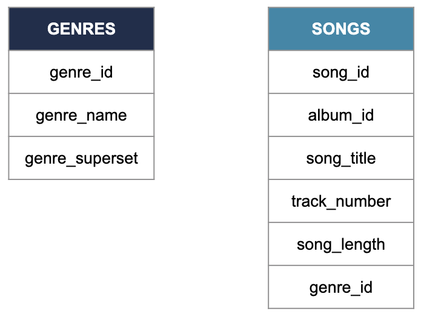

## Structures
In the video, you learned about the three different types of data structure. The less structured the data, the more flexibility there is in how it's stored.

Which of the following statements is false? Select one answer

- [ ] Structured data is easier to search because values are separated and organized into columns.
- [ ] Semi-structured data allows some flexibility that structured data doesn't: different observations have different sizes.
- [x] Structured data makes it harder to draw relationships with other data tables.

> Good job! This statement is completely false: structured data make it super easy to draw relationships between tables.

 

## What's the difference
You've just learned that data can exist in different structures. Can you correctly define structured, semi-structured and unstructured data?

**Instructions**

Classify the statements to the data structure they correspond to.

| Structured | Semi-structured | Unstructured |
| ---------- | --------------- | ------------ |
| Is easy to search and organize. | Is moderately easy to search and organize. | Is difficult to search and organize. |
| Corresponds to data in tabular format. | Follows a model while allowing more flexibility than structured data. | Is usually stored in data lakes. |

> Excellent job on this one! Structured, semi-structured and unstructured data are fundamental concepts in data engineering. Now let's learn a little more about SQL!

 

## We can work it out
Which language is the industry standard to create, update, maintain and query databases? Select one answer

- [ ] English
- [ ] Python
- [x] SQL
- [ ] JavaScript

> Absolutely! Structured Query Language was developed in the 70s at IBM for the exact purpose of managing and retrieving data from structured/relational databases. 

 

## Columns
Which column allows these two tables to form a relational database? Select one answer

- [ ] The Column of Marcus Aurelius
- [x] The `genre_id` column
- [ ] The `genre_name` column
- [ ] The `genre_superset` column

> Exactly! The genre_id column appear in both tables, so it can be used to connect them.

 

## Different breeds
SQL is the industry standard for Relational Database Management Systems. In other words, it is to databases what English is to pop music.

However, data engineers and data scientists don't use it the same way. Within the data science team at Spotflix, there are a few tasks that need to be assigned to either the data engineers or the data scientist. Can you help them do that?

**Instructions**

Decide whether these tasks should be taken care of by data engineers or data scientist.

| Data engineers | Data scientists |
| -------------- | --------------- |
| Modifying the whole songs table to remove trailing spaces entered by mistake in front of the title. | Querying the artist table to find all the bands that come from France. |
| Updating an artist's table after they edited their biography. | Querying the top songs of the past year to identify which genre dominated. |
| Creating a new table to store the songs customers listened to the most over the past year. | Querying the lyrics table to find all the songs that have 'data' in the title. |

> Kaboom! Now you can tell if someone is a data engineer or a data scientist just by asking how they use SQL! Onwards to the next lesson to learn more about the different data storage solutions.

 

## Tell the truth
So far, you heard about data lakes, data warehouses, databases, and you just saw the differences between the three.

Which of the following statements is true? Select one answer

- [ ] A data catalog is a document listing the prices of different data storage services.
- [x] A data warehouse is a type of database.
- [ ] A relational database usually stores unstructured data.
- [ ] The data lake stores well-organized, processed data that's easy to analyze.

> Right! A "database" is a very general term, and a data warehouse is a type of database. Data warehouses also have subsets, like data marts, which are highly curated for a particular community of users, such as a specific team Data marts are also much smaller, tens of gigabytes instead of the hundreds of gigabytes to petabytes of data that can be held in a data warehouse.

 

## Our warehouse (in the middle of our street)
Although both are used for data storage, data lakes and data warehouses are used for different purposes and work in different ways.

Can you correctly classify the statements, depending on whether they apply to data lakes or data warehouses?

**Instructions**

Classify the statements: do they apply to data lakes or data warehouses?

| A data lake | A data warehouse |
| ----------- | ---------------- |
| Stores raw data | Usually stores smaller amounts of data than the other. |
| Is optimized for cost efficiency. | Is optimized for analysis. |
| Can store structured, semi-structured and unstructured data. | Stores mainly structured data. |

> Excellent job! You definitely know how to distinguish a data lake from a data warehouse, when it's better to use one versus the other, what they are optimized for and who uses them. Click Continue to jump in Chapter 3, and learn how data is moved and processed!
