## Interpreting scatter plots
Scatter plots let you explore the relationship between two continuous variables.

Here you can see a scatter plot of average life expectancy (on the y-axis) versus average length of schooling (on the x-axis) for countries around the world. Each point in the plot represents one country. A straight trend line from a linear regression model is shown.

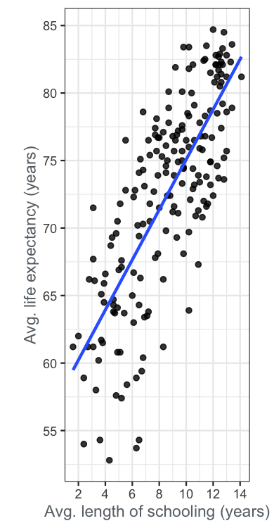

Data source: [United Nations](http://hdr.undp.org/en/content/2019-human-development-index-ranking)

**Instructions**

Categorize these statements about the scatter plot as true or false.

| True | False |
| ---- | ----- |
| As the average length of schooling increases, the average life expectancy typically increases too. | There is a negative correlation between the life expectancy and the length of schooling. |
| There is a positive correlation between the life expectancy and the length of schooling. | No countries have an average length of schooling less than 6 years and an average life expectancy of more than 75 years. |
| Every country with an average life expectancy of less than 60 years has an average length of schooling less than 7 years. | If one country has a longer average length of schooling than another country, that country will also have a greater average life expectancy. |

> Skillful scatter plot interpreting! Scatter plots are excellent for exploring the relationship between two continuous varaibles.

 

## Trends with scatter plots
Adding trend lines to a scatter plot can make it easier to articulate the relationship between the two variables.

Here you can see the life expectancy for each country again, this time plotted against the Gross National Income (GNI) per capita (a measure of how rich the country is). You have a choice between linear and logarithmic scales on the x-axis, and can add linear or curved trend lines.

Which statement best describes the trend?

**Instructions**

- [ ] Life expectancy increases linearly with GNI when GNI is between $1k and $50k.
- [x] Life expectancy increases linearly with the logarithm of GNI when GNI is between $1k and $50k.
- [ ] Life expectancy decreases when GNI increases above $50k.
- [ ] Life expectancy increases when GNI decreases below $500.

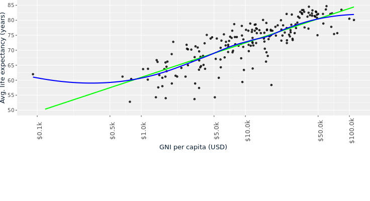

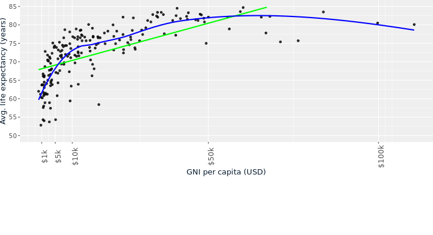

> Terrific trend line usage! By comparing the linear and LOESS curved trend lines you can easily see when the data is increasing faster or slower than linearly, which can help you describe the relationship between the variables.

 

## Interpreting line plots
Line plots are excellent for comparing two continuous variables, where consecutive observations are connected somehow. A common type of line plot is to have dates or times on the x-axis, and a numeric quantity on the y-axis. In this case, "consecutive observations" means values on successive dates, like today and tomorrow. By drawing multiple lines on the same plot, you can compare values.

The following line plot shows the percentage of households in the United States that adopted each of four technologies (automobiles, refrigerators, stoves, and vacuums) from 1930 to 1970.

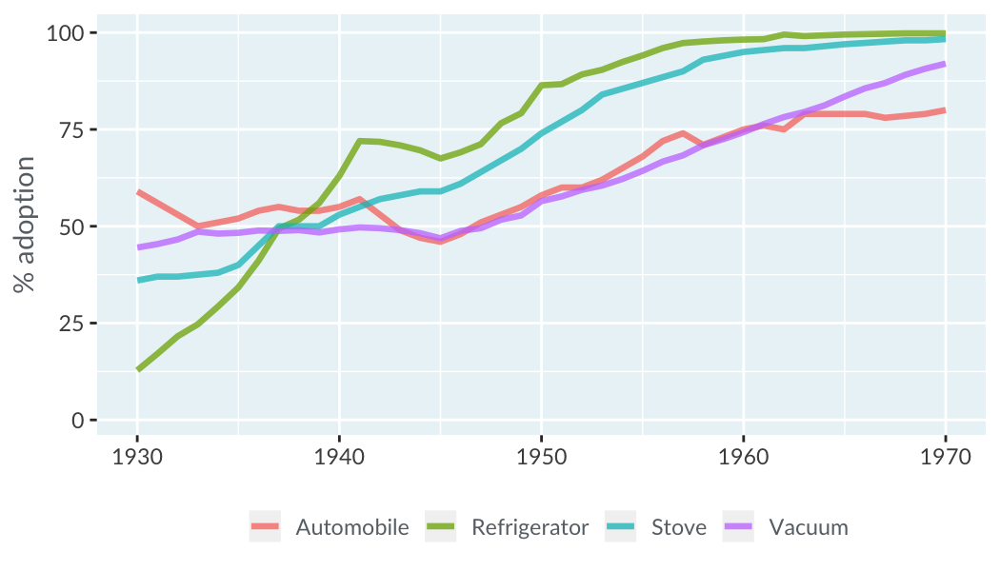

Data source: [Hannah Ritchie and Max Roser (2019) - Technology Adoption](https://ourworldindata.org/technology-adoption)

**Instructions**

Categorize these statements about the line plot as true or false.

> Terrific tech adoption analysis! Line plots are especially good at letting you answer questions about continuous values over time.

 

## Logarithmic scales for line plots
If you have a dataset where the values span several orders of magnitude, it can be easier to view them on a logarithmic scale.

A subset of the COVID-19 coronavirus data is shown in the line plot. You saw in the video that most of the cases in early 2020 occurred in mainland China. You might wonder what is happening in the rest of the world. Here, the six countries with the most number of confirmed cases outside of mainland China are shown.

On the linear scale, notice that moving up one grid line in the plot adds 20000. On the logarithmic scale, moving up one grid line in the plot multiplies by 4.

Considering the six countries on the plot, which statement is true?

**Instructions**

- [ ] On Feb 3, excluding mainland China, US had the most cumulative confirmed cases of COVID-19.
- [x] On Feb 17, Germany had more cumulative confirmed cases of COVID-19 than France.
- [ ] On Mar 02, Iran had less than 1000 cumulative confirmed cases of COVID-19.
- [ ] On Mar 16, US had less than 4000 cumulative confirmed cases of COVID-19.

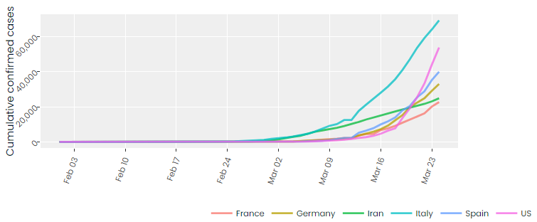

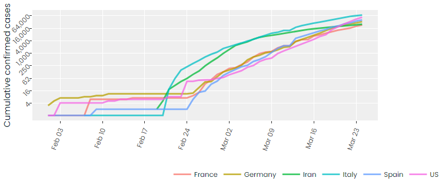

> Lovely line plot interpreting! If your data spans many orders of magnitude, choosing a logarithmic y-axis can make it easier to distinguish between the lines.

 

## Line plots without dates on the x-axis
Although dates and times are the most common type of variable for the x-axis in line plot, other types of variable are possible.

In the video, you saw data on the ages of juvenile offenders in Switzerland. That data was presented with time on the x-axis and one line for each age. Since that plot wasn't very satisfactory, we'll try again. This time, age is on the x-axis and there is one line for each year. In the plot you can see two separate clusters of lines representing different age profiles for the offenders.

Which year did the change in age profile of juvenile offenders take place?

Data source: [Senior Attorney of the Canton of Zurich](https://opendata.swiss/en/dataset/statistik-der-jugendstrafrechtspflege-des-kantons-zuerich/resource/41430d20-d449-4a9b-bf91-3f9a16c9f229)

**Instructions**

- [ ] 2009
- [ ] 2010
- [x] 2011
- [ ] 2012

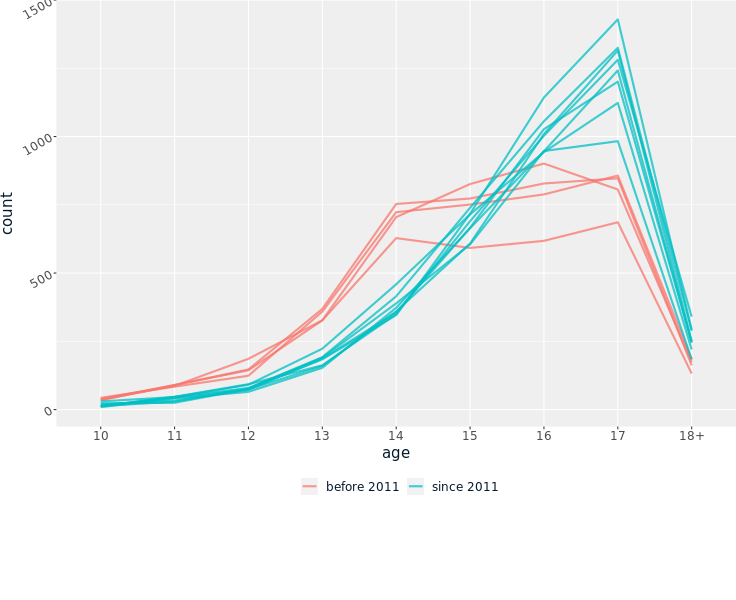

> A mature solution to visualizing juvenile offenders! Line plots don't need time on the x-axis; numbers work just as well.

 

## Interpreting bar plots
Bar plots are a great way to see counts of each category in a categorical variable.

The ESPN Top 100 famous athletes dataset has two categorical variables: country and sport.

Explore the plots and determine which statement is false.

**Instructions**

- [ ] Germany had the third most famous athletes.
- [ ] Five sports had more than five famous athletes.
- [ ] Soccer players from the USA had more famous athletes than any other country/sport combination.
- [ ] There were more famous cricketers on the list than famous French athletes.

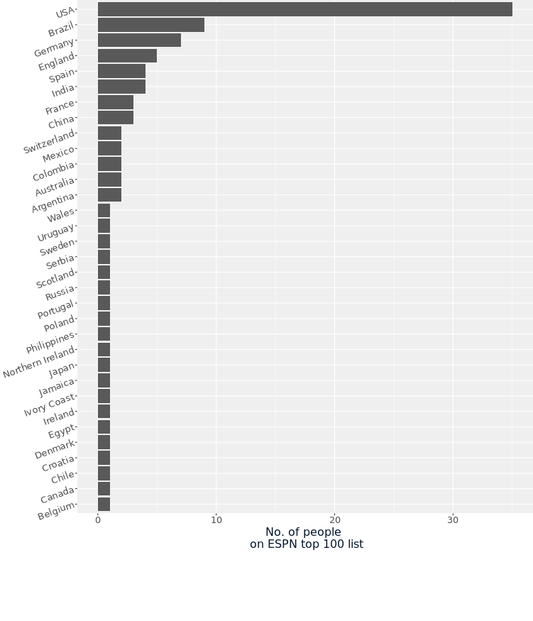

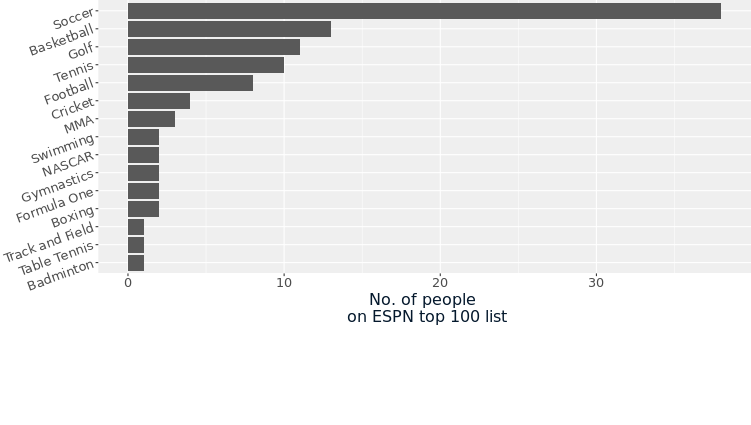

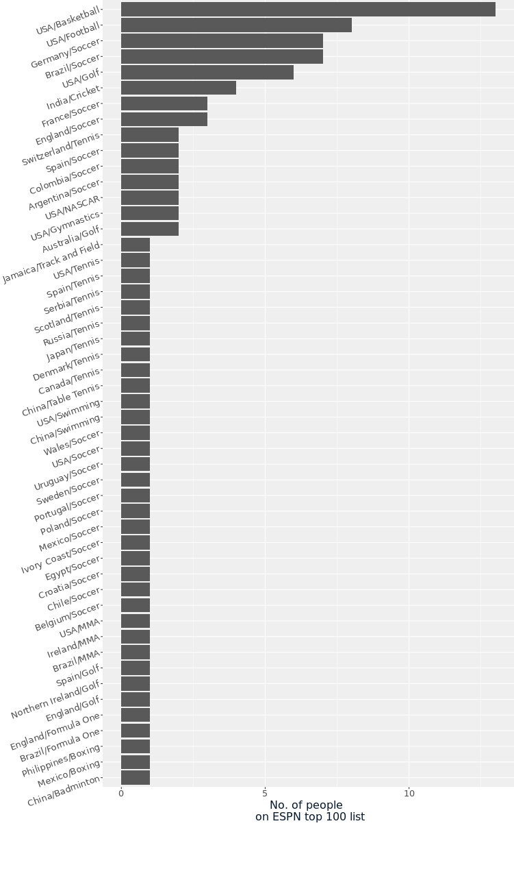

> Badass bar plot interpretation! Although USA had the most famous athletes by country, and soccer had the most famous athletes by sport, there were no famous soccer players from the USA. By looking at both categories at once, you saw that the most common categories for famous athletes were basketball and football players in the USA, and soccer players in Germany and Brazil.

 

## Interpreting stacked bar plots
If you care about percentages rather than counts, then stacked bar plots are often a good choice of plot.

The dataset for this exercise relates to another question from the Health Survey for England. Adults aged 65 or more were asked how many "activities of daily living" (day-to-day tasks) they needed assistance with.

Type show_plot in the DataCamp console and press ENTER to see the plot. It's interactive – hover your mouse over the bars to see the percentage for that block.

Which statement is true?

**Instructions**

Possible answers

- [ ] Less than half the women aged 80+ needed assistance for two or more activities.
- [ ] The group with the smallest percentage of people needing assistance for exactly one activity was men aged 75-79.
- [x] The group with the largest percentage of people needing no assistance was men aged 70-74.
- [ ] More than half the men aged 80+ needed assistance for at least one activity.

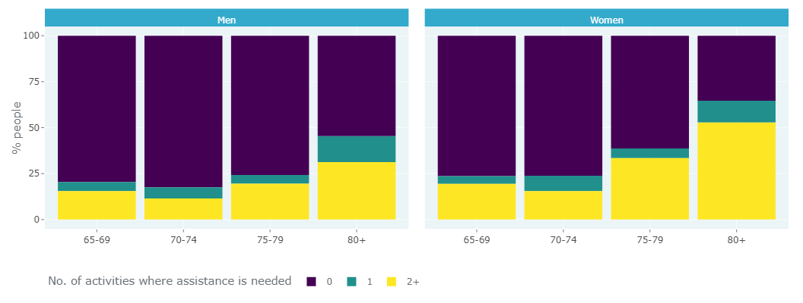

> Stunning stacked bar plot interpretation! For percentages of categorical variables, stacked bar plots are an excellent choice of visualization.

 

## Interpreting dot plots
Dot plots are similar to bar plots in that they show a numeric metric for each category of a categorical variable. They have two advantages over bar plots: you can use a log scale for the metric, and you can display more than one metric per category.

Here is a dot plot of the social media followings of the ESPN 2017 top 100 famous athletes, with one row per athlete. Three metrics are shown for each athlete: the number of followers on Facebook, Instagram, and Twitter. Only the athletes for Basketball, Cricket, Soccer, and Tennis who had accounts on each platform are shown. Rows are sorted alphabetically for each sport.

A dot plot of the number of social media followers for famous basketballers, cricketers, soccer players, and tennis players. The social media platforms are Facebook, Instagram, and Twitter.

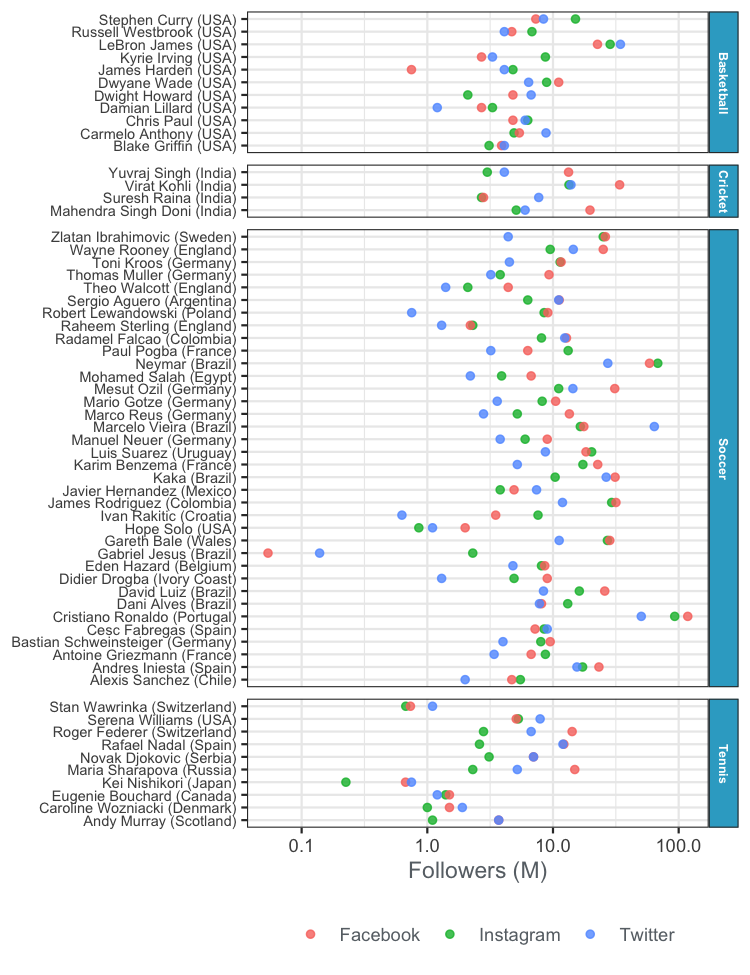

Based on the plot, which statement about the athlete's social media following is false? Select one answer.

- [ ] Basketball: Russell Westbrook has more Instagram followers than Carmelo Anthony.
- [ ] Cricket: Virat Kohli has more followers on Facebook than the other platforms.
- [x] Soccer: Cristiano Ronaldo has more Twitter followers than Marcelo Viera.
- [ ] Tennis: Maria Sharapova has more Facebook followers than Roger Federer.

> Delightful dot plot interpretation! Dot plots are like bar plots, but you can use log scales and show multiple metrics on each row.

 

## Sorting dot plots
As with box plots and bar plots, how you order the rows in a dot plot affects the kinds of questions that are easy to answer.

Here you can see the Big Mac Index: the price of a McDonalds Big Mac in various countries around the world (in Jan 2020). The "Actual price" is the price converted to US dollars. The "GDP adjusted price" has an additional correction for the gross domestic product of a country. Roughly, if people earn less in a country, it will cost more using the adjusted price.

By default, the rows in the dot plot are ordered alphabetically. This makes it really easy to look up the price for a specific country, but difficult to answer question about where the most expensive or least expensive Big Macs can be found. By sorting the rows by price, those questions are easier to answer.

Which statement is true?

Data source: [The Economist](https://github.com/TheEconomist/big-mac-data)

**Instructions**

- [ ] Ukraine has the fifth most expensive Big Macs by actual price.
- [x] Two countries have Big Macs that cost over 100 USD after adjusting for GDP.
- [ ] After adjusting for GDP, South Africa has the cheapest Big Macs.
- [ ] Azerbaijan has the fifth most expensive Big Macs by actual price.

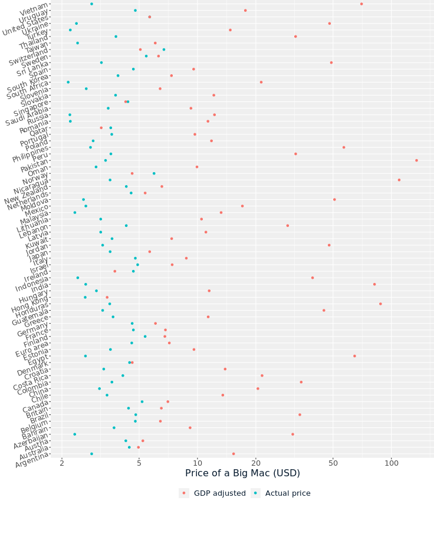

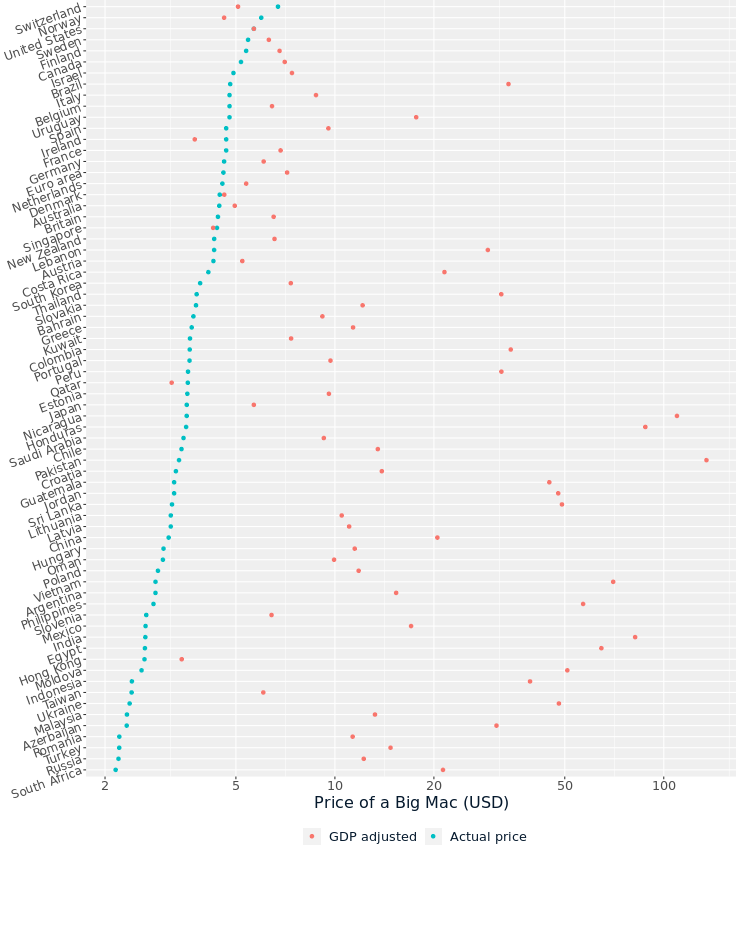

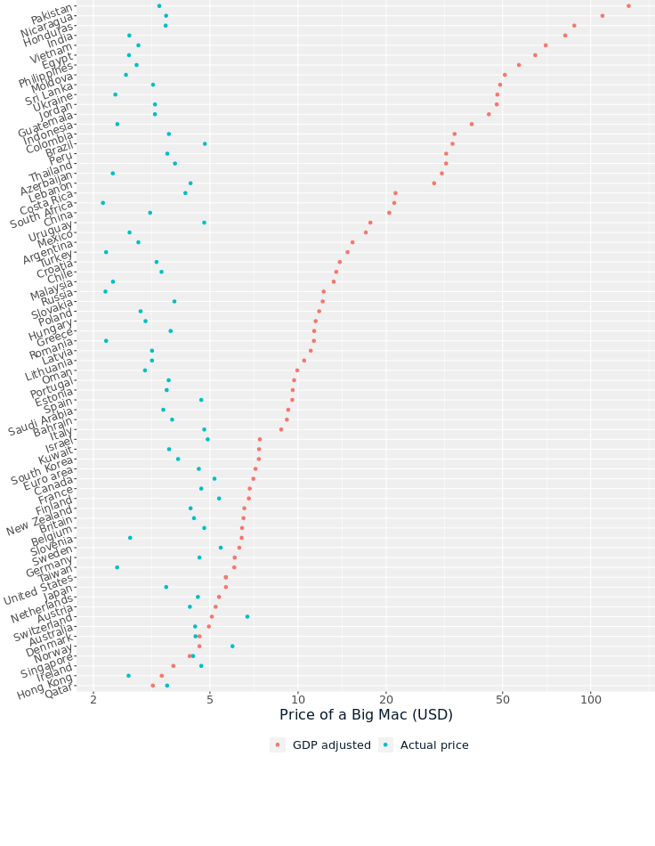

> Super sorting! Big Macs appear to be luxury cuisine in Pakistan and Nicaragua. By changing the sort order to one of the prices, questions about highest or lowest prices are much easier to answer.
