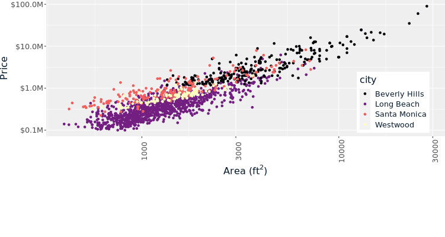
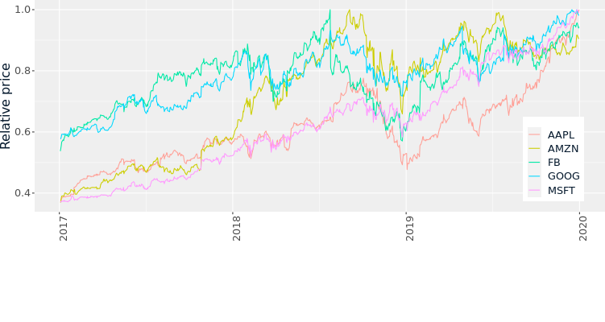
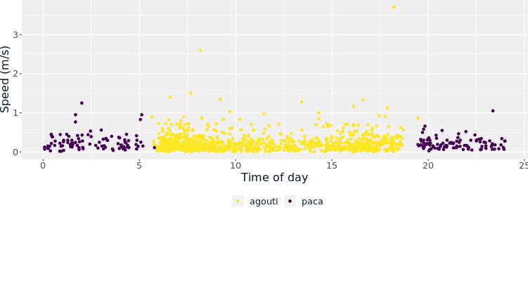
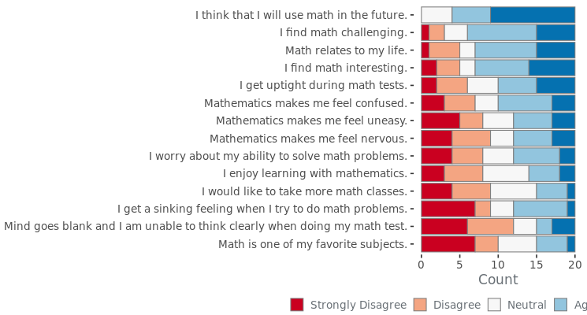
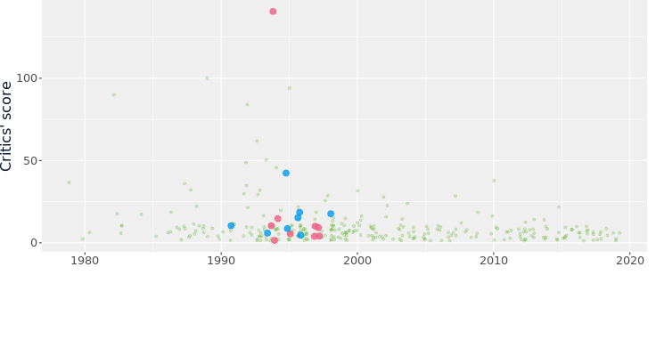
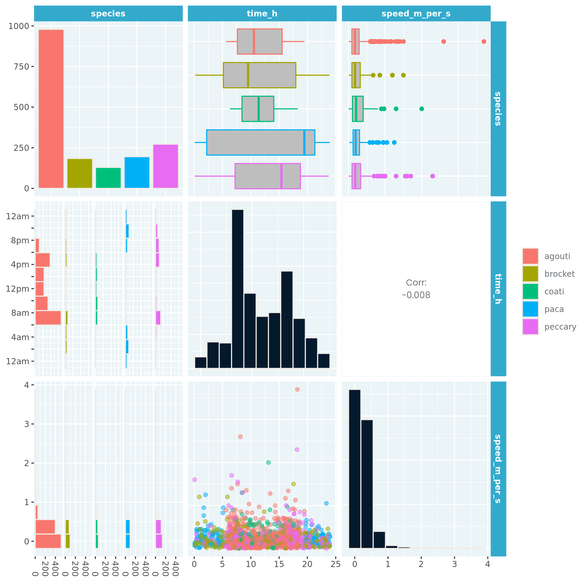
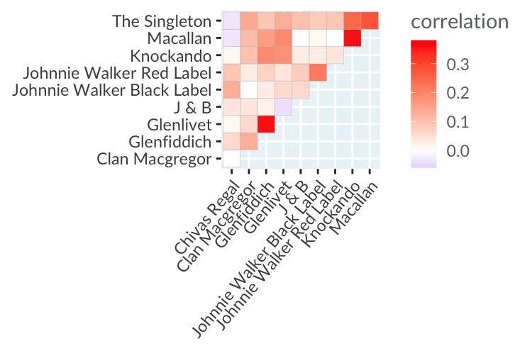

## Another dimension for scatter plots
If you have a scatter plot, but want to distinguish the points in some way based on another variable, then you have a few options. As discussed in the video, 3D plots are usually dreadful on a 2D screen, but there are other options to stick to x-y axes and still visualize the third dimension. You can change the color, size, transparency or shape of the points, or split the plot into multiple panels.

Here you can see the dataset of house prices in Los Angeles county, USA, that you first encountered in Chapter 2.

Explore different options for distinguishing points from the four cities, then determine which statement is false.

**Instructions**

- [ ] Using different sizes or transparencies makes it hard to distinguish points that overlap.
- [ ] Using separate panels provides the best way to distinguish points from each city, but makes it harder to see if there is a single trend across the whole dataset.
- [ ] Using different shapes provides the best way to distinguish points from each city, but makes it harder to see if there is a single trend across the whole dataset.
- [ ] Using different color provides a good way to distinguish points from each city, but lighter colors can be hard to see against a white background.

> Distinguished point distinguishing! There are several different ways of distinguishing points in a scatter plot, but color and separate panels are the most reliable methods, unless you want to spend hours squinting at the plot.

 

## Another dimension for line plots
As with points in a scatter plot, you may often want to be able to distinguish several lines in a line plot. Like points, you can change the colors or transparency level, or use multiple panels. The two differences to points are that you can change line widths rather than point sizes, and you can change linetype (solid, dashes, or dots) rather than point shape.

The line plot shows the stock price for five technology companies collectively known as "FAAMG": Facebook (FB), Apple (AAPL), Amazon (AMZN), Microsoft (MSFT), and Google (GOOG). The prices have been adjusted for dividends and splits, then scaled to be relative to their highest price over the time period so they are more easily comparable.

Explore different options for distinguishing lines from the five companies, then determine which statement is false.

Data source: [Yahoo Finance](https://finance.yahoo.com/)

**Instructions**

- [ ] All five companies began 2018 with a higher price than they began 2017.
- [ ] In 2018, Facebook's stock price decreased by a greater fraction than any of the other companies.
- [ ] From the start of 2019 to the start of 2020, Apple's stock price more than doubled.
- [x] All five companies began 2020 with a higher price than they had half way through 2019.

> Your line plot skills are limitless! Amazon's stock price decreased in the second half of 2019. Similar to the case of scatter plots, the best choices for distinguishing lines are often colors or separate panels.

 

## Eye-catching colors
Not all colors are as eye-catching as others. This can cause a problem for data visualization, because having some data point more obvious than others can bias the way you interpret a plot. Unless you specifically want to highlight some points, each data point should be as easy to look at as all the others.

Here you can see the dataset from the camera trap in Panama. This time, the speed of the animal as they passed the camera is plotted against the time of day that they were caught on camera, and the agouti have been joined by another rodent, the paca.

Each version of the plot contains purple and yellow points, but in one version, the purple points are easier to perceive than the yellow points.

Which statement is true?

**Instructions**

- [ ] To ensure that all data points are equally perceivable, they should all have the same color.
- [ ] To ensure that all data points are equally perceivable, they should all have the same chroma.
- [ ] To ensure that all data points are equally perceivable, they should all have the same luminance.
- [x] To ensure that all data points are equally perceivable, choose a qualitative, sequential, or diverging scale in hue-chroma-luminance colorspace.
- [ ] To ensure that all data points are equally perceivable, they should all have the same hue.

> Confident coloring! The colors you choose for your plots will affect how the plot is interpreted. Using a qualitative, sequential, or diverging scale in hue-chroma-luminance colorspace is almost always the best option.

 

## Qualitative, sequential, diverging
There are three types of color scale, each designed to highlight different things in a visualization.

| Type | Purpose |
| ---- | ------- |
| qualitative | Distinguish unordered categories |
| sequential | Show ordering |
| diverging | Show above or below a midpoint |

Here you can see the results of a survey about math anxiety from a class of students. Each question has its own row, and responses range from "Strongly Disagree" to "Neutral" to "Strongly Agree".

Choose an appropriate color scale for the plot.

Data source: [Bai et al. (2009)](https://www.rdocumentation.org/packages/likert/topics/mass)

**Instructions**

- [ ] None
- [ ] Qualitative
- [ ] Sequential
- [x] Diverging

> Divine use of a diverging scale! A diverging scale is appropriate here since the responses have a natural midpoint of “Neutral”.

 

## Highlighting data
Up to now we've focused on using color and other plot aesthetics to make all data points stand out as much as others. Usually that's a good idea, but occasionally you'll want to highlight specific data points.

Here's the dataset of the greatest hip-hop songs of all time, from Chapter 2. Songs by two rappers at the center of the 1990s East Coast-West Coast hip-hop Rivalry, The Notorious B.I.G. and 2Pac, are colored differently.

Use the sliders to control the highlighting of songs by these artists via point size, transparency, and chroma.

How many songs for each artist made it onto the critics' list?

Instructions

- [x] The Notorious B.I.G. has 9 and 2Pac has 8.
- [ ] The Notorious B.I.G. has 7 and 2Pac has 7.
- [ ] The Notorious B.I.G. has 8 and 2Pac has 7.
- [ ] The Notorious B.I.G. has 7 and 2Pac has 8.
- [ ] The Notorious B.I.G. has 9 and 2Pac has 7.

> “Even when I was wrong, I got my point across” - The Notorious B.I.G. A.k.a. Biggie Smalls. “If you make your points bigger or smaller, it can help you get your point across” - Richie

 

## Interpreting pair plots
To get a quick overview of a dataset, it's really helpful to draw a plot of the distribution of each variable, and the relationship between each pair of variables. A _pair plot_ displays all these plots together in a matrix of panels. It shows a lot of information at once, so to interpret it, try looking at one panel at a time.

Here you can see the Panamanian camera trap data for the agouti and paca, as well as three new species: coati, brocket, and peccary.

**Instructions**

Categorize these statements about the pair plot as true or false.

| True | False |
| ---- | ----- |
| There are more than 250 sightings of peccary in the dataset. | All species were caught on camera most often around dawn (6am) and dusk (6pm). |
| Most animals were travelling at less than 1 m/s when caught on camera. | The animal with the fastest 75th percentile speed on camera was an agouti. |
| Paca is the only nocturnal animal in the dataset. | There is a strong negative correlation between time of sighting and speed of the animal. |

> Perfect pairing! Pair plots are fantastic for getting quick insight into several variables at once.

 

## Interpreting correlation heatmaps
If you want to find the relationship between many pairs of numeric variables, you can use a close relative of the pair plot, namely the _correlation heatmap_. It takes the correlation scores you saw from the pair plot, but rather than giving you lots of numbers to look at, it displays them using colors. A great use case for this is finding related products.

Here's a dataset from a survey on scotch whisky consumption. In the correlation heatmap, each row and column shows a brand of scotch, and cells show that correlation between drinking one brand and drinking another within the past twelve months.

Data source: [Bayesian Statistics & Marketing](http://www.perossi.org/home/bsm-1)

**Instructions**

Categorize these statements about the correlation heatmap as true or false.

>

 

## 

> 
