## Pie plots
Pie plots (sometimes called pie charts) are extremely popular, but often difficult to interpret. They are just bar plots converted into polar coordinates, and humans are generally worse at perceiving angles accurately compared to lengths.

Following on from the scotch whisky dataset in the last chapter, here's another dataset from the Health Survey for England, this time on alcohol consumption in English men aged 16 or more. Pie segments and bar heights represent percentages of responders.

Look at the pie plot and the bar plot and determine which statement is true.

**Instructions**

- [ ] Only the 75+ age group had more non-drinkers than people drinking 14 to 35 units per week.
- [ ] Three age groups had more than 30% of people drinking 14 to 35 units per week.
- [ ] All age groups had less than 20% non-drinkers.
- [x] All age groups had at least 50% of people drinking up to 14 units per week.

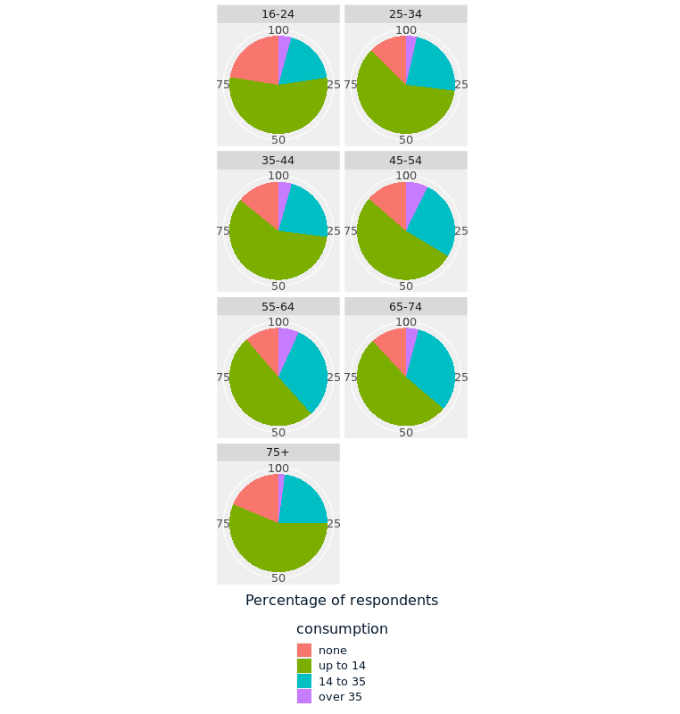

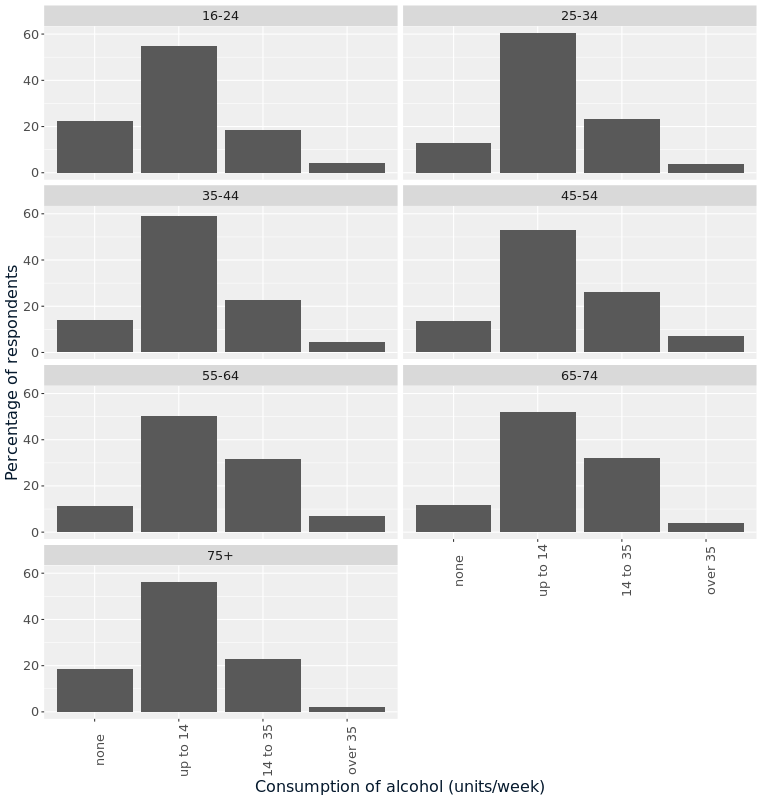

> Delightful drinking plot interpretation! Polar coordinates are usually a bad idea. A bar plot is almost alway easier to interpret than a pie plot.

 

## Rose plots
One good use case for polar coordinates is when the data is naturally circular, for example, when it is a compass direction. If you plot a histogram with polar coordinates, you get a rose plot.

Here you can see a plot of wind direction data from a meteorological mast. Knowing the predominant wind direction is important for weather modeling and for determining where to site wind turbines. Wind measurements were taken at 10 minute intervals over an eight month period.

Look at the histogram and rose plot, then determine which statement is true.

Data Source: [bReeze](https://www.rdocumentation.org/packages/bReeze/topics/winddata)

**Instructions**

- [ ] The distribution of the wind directions has three peaks.
- [x] The predominant wind directions were N and SW.
- [ ] The distribution of the wind directions has one peak.
- [ ] The predominant wind directions were E and NW.

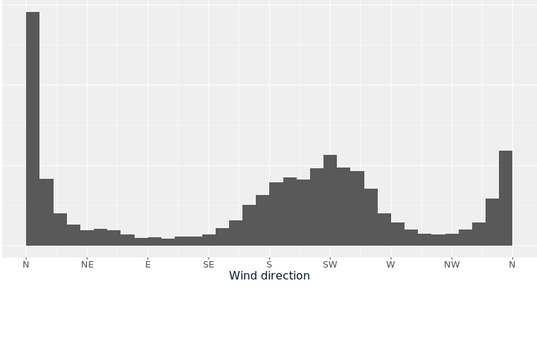

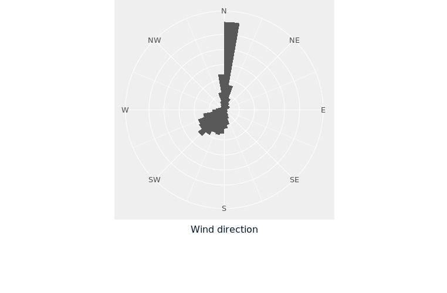

> Wild wind interpreting! For cyclical data, polar coordinates can sometimes make a plot easier to interpret.

 

## Bar plot axes
When we look at a bar plot, we use the relative lengths of each bar to help interpret what is happening. If you don't include zero on the axis used for bar lengths, then the relative lengths of bars are distorted, and it is easy to be misled.

Here is a bar plot of another question from the Health Survey for England, this time about people with asthma. ("Not asthmatic" means no asthma symptoms were reported, and no medication was taken for asthma in the previous 12 months.)

Compare version of the plot with each y-axis, and determine which statement is true.

**Instructions**

- [ ] The percentage of asthmatics is less than 15% for every age group.
- [ ] 16-24 years olds have more than twice the percentage of non-asthmatics than 45-54 year olds.
- [ ] The majority of people aged 35-74 are asthmatic.
- [ ] The percentage of asthmatics ranges from about 40% to about 80%, depending upon the age group.

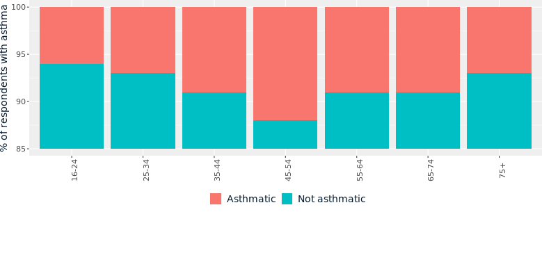

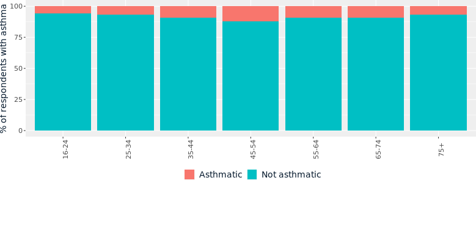

> Bad-ass bar plot axis interpretation! When zero is not included in the y-axis, you have to really stare at the axis labels to know what is happening, and it is easy to be misled.

 

## Dual axes
One popular but terrible idea is to draw a scatter plot or line plot with two different y-axes. This typically happens when you have two metrics with different units, and different scales that you want to plot against a common x-axis. The problem is that by changing the relationship between the two axes, you can tell almost any story that you want with the data.

Here you can see the stock prices of Microsoft (MSFT) and Amazon (AMZN) from 2017 to 2020. When you saw these in Chapter 3, each price had been adjusted to relative to the maximum for that company. That way each line was comparable. Here, the prices have been adjusted for dividends and splits but they have not been scaled relative to their maxima.

Adjust the vertical position and steepness of the slope for the AMZN line, then determine which statement is true.

**Instructions**

- [ ] MSFT and AMZN are strongly positively correlated.
- [ ] MSFT and AMZN are strongly negatively correlated.
- [ ] MSFT and AMZN have no correlation.
- [x] You can't make a conclusion about the correlation of MSFT and AMZN from this plot.

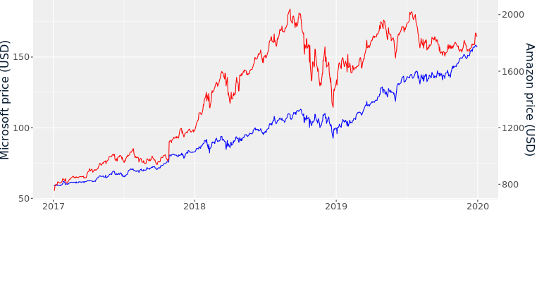

> Delightful debunking of dual axes! It would have been better to draw each line in its own panel, like this. 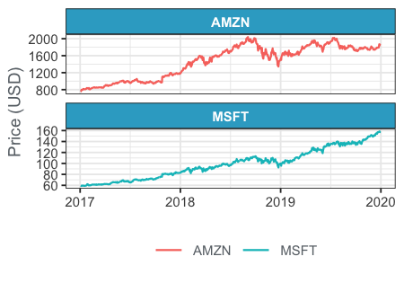

 

## Chartjunk
Chartjunk is anything in a plot that distracts from getting insight. That is, removing it would make the plot easier to understand.

Here's the scatter plot of the greatest hip-hop songs from Chapter 2, this time with added bling.

A scatter plot of critically acclaimed hip-hop songs over time, with added bling, such as a gold background and dollar signs instead of points.

Which element of the plot is not chartjunk? Select one answer.

- [ ] Bold, italic text
- [ ] Chunky grid lines
- [ ] Dollar signs for points
- [ ] Golden panel background
- [ ] Axis labels

> Joyous junk detection! The font face may have been terrible, but having axis labels helps readers interpret the plot, so they aren't chart junk. In general, anything that makes it harder to interpret a plot should be removed.

 

## 

> 

 ## Multiple plots**
Sometimes a dataset is so complex that it takes several plots to explore properly. Rather than trying to find a single, perfect plot that captures all the insight, you can combine several plots into a report or – if you want to have fun – a dashboard.

Here you can see the German Bundesrat (Federal Council) seats dataset in a dashboard of three plots. In the "by party" plots, values are colored according to each party's marketing brand color. The level of transparency is based on power: the primary party in a coalition is fully opaque, secondary parties are slightly transparent, and tertiary parties are very transparent.

Explore the dashboard and determine **which statement is false**.

**Instructions**

- [ ] The coalition with the most seats is `SPD+CDU`.
- [ ] The Grüne party have more seats as the secondary party in a coalition than any other party.
- [x] The SPD have more seats as the tertiary party in a coalition than any other party.
- [ ] The FDP only have seats in the Western states.
- [ ] Bavaria (the large state in the South East) has different political parties to those found in power in other states.

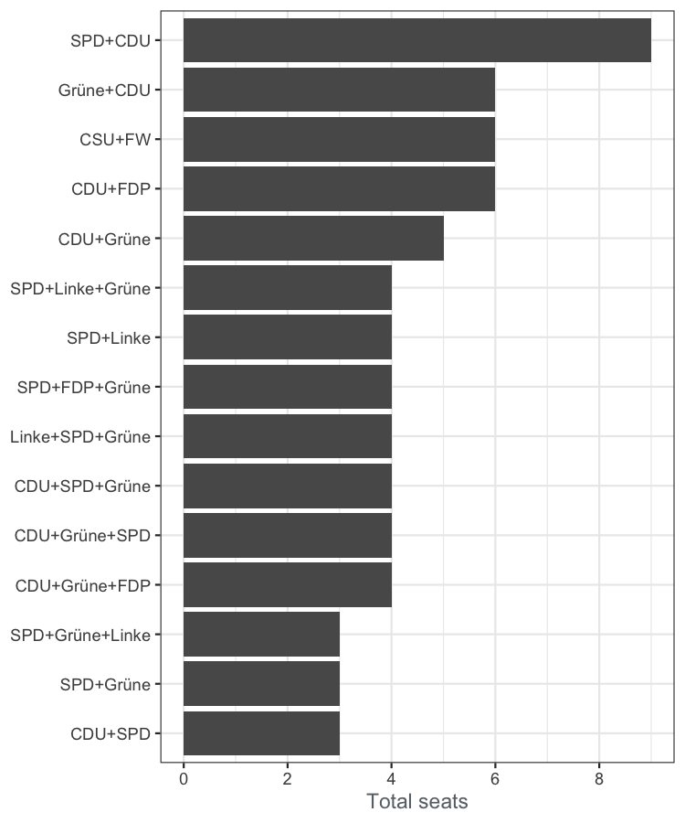

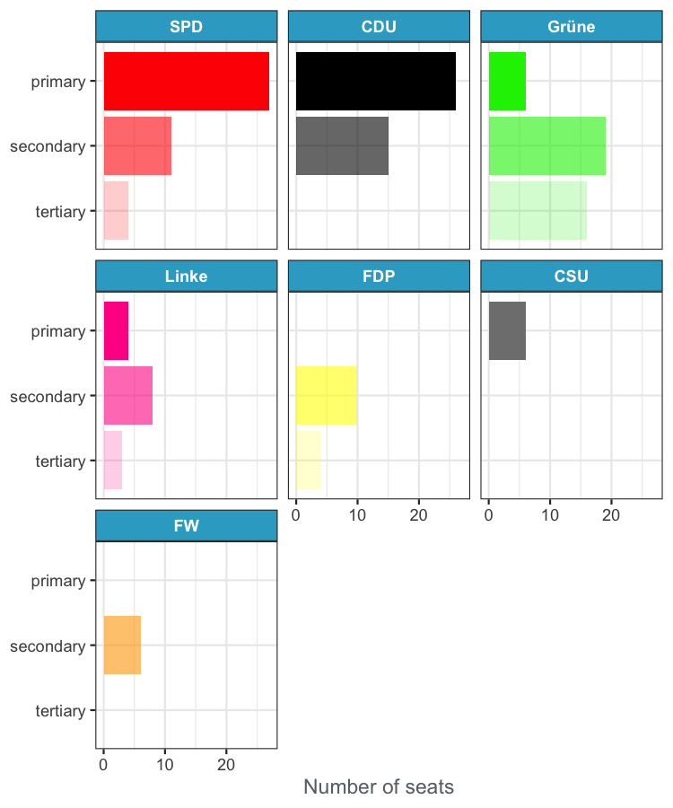

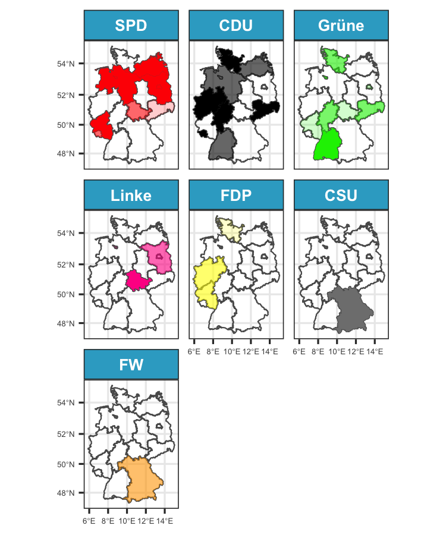

> Perfect political analysis! The Grune party had more seats as the tertiary party in a coalition. For complex datasets, it is often best to draw lots of simpler plots that each answer a couple of questions, rather than trying to draw a single plot that answers everything.
